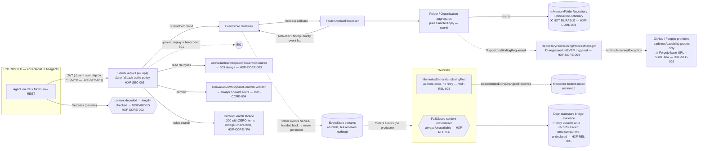

# Sprint Change Proposal & Production-Readiness Audit — Hexalith.Folders

- **Date:** 2026-07-14
- **HEAD:** `4ed58e1` (`main`) — working tree has 60 pre-existing uncommitted files (see §Audit Limitations); no files were modified by this audit.
- **Trigger:** `/bmad-correct-course` invoked with an exhaustive, evidence-based, read-only production-readiness audit brief (principal .NET architect / app-sec / Git-systems / MCP-tooling / SRE / test-architect lens).
- **Method:** six independent parallel read-only audit agents (durable-Git trace; security & multi-tenancy; MCP/CLI/SDK/contracts; reliability/ops/observability & performance; product completeness; verification quality), each reading source directly with `file:line` evidence, cross-verified against one another. Plus a local baseline build/test run and a live CI-run inspection. No planning-doc or test-name claim was accepted as proof of a working capability.
- **Scope classification:** **MAJOR** — fundamental replan (PM + Architect). Not implementable as a direct backlog tweak.
- **Change scope of this document:** analysis, findings, and proposal only. No code, spec, epic, or `sprint-status.yaml` change is applied here — the proposed edits are listed for approval.

---

## Executive verdict (TL;DR)

**Is the module safe and ready for production LLM/agent use? — NO. No-go.**

Hexalith.Folders is an exceptionally well-built **control-plane shell** wrapped around a **non-functional data plane**. The contract spine, SDK/CLI/MCP parity, idempotency/correlation discipline, error taxonomy, authorization *layering*, safe-denial semantics, and domain modeling are genuinely high quality and among the most rigorous in the ecosystem. But **every seam that touches actual document bytes or durable state is an `Unavailable*` / `InMemory*` placeholder with no production implementation in the repository.** As shipped, an authenticated agent can acquire locks and receive well-formed `202 Accepted`s, but **cannot persist, retrieve, search, version, commit, or verify a single document, and can never observe a task completing.**

This is not merely "untested" — it is **absent by construction**, and in three places **actively destructive** (uploaded content is discarded; a deleted document stays permanently searchable; an accepted task is unresolvable after a restart).

### What is implemented vs scaffolded

| Layer | State |
|---|---|
| OpenAPI contract spine (49 ops, 3.1), drift gates, SDK codegen | **Implemented, rigorous** |
| CLI (41/49) + MCP (49/49 tools) adapters, parity oracle | **Implemented** (protocol-metadata gaps) |
| Idempotency, correlation, error envelope, safe-denial, path validation | **Implemented, strong** |
| Domain aggregates (Folder/Organization pure `Handle`/`Apply`), authorization *logic* | **Implemented, sound** |
| Folder aggregate **durability** (event persistence) | **Absent** — only impl is `InMemoryFolderRepository`; ADR-0001 returns `NoOp` (empty events) to the gateway, so even the durable EventStore receives nothing |
| Document content store (upload/read-back) | **Absent** — decoded then discarded; read source is an `Unavailable` stub → 503 |
| Git write path (repo provision, commit, push) | **Absent** — commit executor always fails; provider write methods throw `NotImplementedException`; provisioning process manager never triggered |
| Task-completion pipeline | **Absent** — nothing ever transitions a task to `completed` |
| Durable read models / projections / replay | **Absent** — all process-local memory; `/project` replay is a hardcoded 501 |
| Search (context + semantic index) | **Inert** — fail-closed producer + fail-safe-empty consumer end to end |
| Production host boot | **Fails by design** — no EventStore-backed repository exists; startup assertion throws in `Production` |

### The five most important risks

1. **No durable persistence anywhere (BLOCKER).** Accepted mutations land only in a `ConcurrentDictionary`; ADR-0001's `NoOp` design means folder events never reach the durable EventStore either; `/project` replay is a 501; Production can't boot. Nothing an agent does survives a process restart in any environment. `HXF-CORE-001`.
2. **Documents cannot be stored or retrieved; uploaded content is silently destroyed (BLOCKER).** Content is base64-decoded, length-checked, and dropped at the endpoint; no content store or content read source exists. `HXF-CORE-002`, `HXF-CORE-003`.
3. **Bearer JWT transmitted over plaintext HTTP by CLI and MCP; Forgejo readiness is an SSRF sink (CRITICAL).** No HTTPS/loopback guard on either bearer handler; no private/link-local/metadata-IP block on the caller-configured Forgejo base URL. `HXF-SEC-001`, `HXF-SEC-002`.
4. **`main` is currently CI-red, and readiness is structurally green regardless of reality (CRITICAL/HIGH).** The instruction-file refactor dropped the canonical submodule-init command → `baseline-ci` fails the `SubmodulePolicy` gate on every push; meanwhile production readiness always reports Healthy (no real `IReadinessSnapshotSource`) so an orchestrator would route traffic to a host that can only emit safe-denials. `HXF-OPS-001`, `HXF-REL-002`.
5. **The planning artifacts assert MVP release-readiness that the runtime contradicts (MAJOR governance risk).** Epic 7 "MVP Release Readiness" and Epic 8 "MVP Release Acceptance Closure" (incl. Legal sign-off) are marked **done**, and docs advertise a satisfied golden lifecycle — but that lifecycle only passes because the E2E suites swap in test fakes for the very seams that don't exist. `HXF-VER-001`, `HXF-GOV-001`.

**Recommendation: NO-GO for production LLM/agent use. Conditional-go for continued development** under a corrected MVP definition and a new durable-persistence epic (see Recommended Path). The honest current status is **"contract-complete, runtime-incomplete pre-alpha."**

---

# PART I — CORRECT-COURSE SPRINT CHANGE PROPOSAL

## 1. Issue summary

The triggering event is a commissioned full production-readiness audit. It reveals a **systemic divergence between the module's advertised purpose and its runtime substance**, and a **governance divergence between the sprint's "MVP release ready / release-accepted" status (Epics 7–8 done, Legal signed) and what the code actually does.**

The module's stated purpose is to let LLM agents *safely persist, version, retrieve, search, and manage documents in Git-backed folders.* The audit establishes, with cross-verified `file:line` evidence, that **none of persist / version / retrieve / search / commit is functional end to end**, that the write side has **no durable substrate at all**, and that the production host **cannot start**. Simultaneously, the audit surfaces genuine, non-deferred defects (security, CI-red, vacuous readiness, at-most-once egress, false-confidence gates, resource leaks) on the parts that *do* claim to work.

Crucially, most of the data-plane gaps are **known and honestly documented** in ADRs/architecture as deferrals (ADR-0001 NoOp, fail-closed materializer, Unavailable stubs, seed-backed read models, Stories 10.6 / 11.10). The issue is not that the team hid this — it is that **(a) the deferral is far larger and more load-bearing than the current backlog scopes it, (b) the "MVP release readiness" framing overstates shippability, and (c) a set of real defects independent of the deferral must be fixed regardless.**

This is categorized as: **Misunderstanding-of-status + technical-limitation discovered** (not a failed approach — the architecture is sound; the runtime is unbuilt).

## 2. Impact analysis

### 2.1 Epic impact

| Epic | Sprint status | Audit-driven impact |
|---|---|---|
| **Epic 7 — MVP Release Readiness** | done | **Status is misleading.** "Release readiness" was interpreted as contract/gate/governance readiness; the module cannot persist a document and Production can't boot. Recommend re-scoping/renaming to reflect *control-plane* readiness, not product readiness. |
| **Epic 8 — MVP Release Acceptance Closure** (incl. C3 Legal sign-off) | done | **Governance risk.** A "release acceptance" epic — with Legal sign-off — was closed over a build that cannot fulfil its purpose. The acceptance criteria measured parity/gates/a11y, not durable capability. The Legal sign-off scope should be re-examined against what actually ships. |
| **Epic 10 — Worker semantic-indexing producer** (10.6 ready-for-dev) | in-progress | Story 10.6 (metadata-derived materializer) is necessary but **insufficient**: even a working materializer publishes nothing because upstream folder events never persist (ADR-0001 NoOp) and are never produced on `folders.events`. 10.6 must be sequenced *after* durable persistence exists, or it validates against fakes only. |
| **Epic 11 — Domain-Focus Platform Refactoring** (11.1 done, 11.2 ready-for-dev, 11.3–11.13 backlog) | in-progress | Well-scoped for *code-quality/dedup/platform-adoption* and it already owns several audit items (provider leak 11.5, bearer guards 11.6, ServiceDefaults 11.9, read-model/seam wiring 11.10). But Epic 11 is explicitly a **non-product technical-alignment** epic that "preserves existing wire behavior" — it does **not** deliver the missing data plane, and Story 11.10's "read-model wiring" is narrower than the actual blocker (a durable `IFolderRepository` + content store + Git commit executor + task pipeline). |
| **New epics required** | — | (a) **Epic 12 — Durable Persistence & Git Round-Trip** (the actual product); (b) **Epic 13 — Security & Operational Hardening** for the non-deferred defects (or fold into 11.3/11.5/11.6). |

### 2.2 PRD / MVP impact

The **MVP definition itself must be reviewed.** Two coherent options:
- **(A) "Control-plane MVP" (accept reality, correct the claims):** declare the current MVP as a contract-first control plane; strip "persist/retrieve/version/search documents" from the *shipped* MVP surface and move it to a clearly-labeled Phase 2. Requires PRD + docs + epic-status honesty edits.
- **(B) "Product MVP" (build the data plane):** keep the stated purpose; add Epic 12; the MVP is not done until an agent can round-trip a document to a real Git repo. This is the honest reading of the product brief and is recommended.

Either way, **FR-level traceability must be reconciled**: FRs covering file add/change/remove, commit, range-read, search, and version history are marked satisfied via contract + fake-backed E2E, not runtime.

### 2.3 Architecture-document impact

`architecture.md` is largely honest about deferrals but contains **claims that diverge from code and should be corrected or explicitly labeled aspirational:**
- Working-copy path `D-8` (`/var/lib/hexalith-folders/work/...`) and durability concern #21 map to files that **do not exist** (`Workers/WorkspaceWorkflows/WorkingCopyManager.cs`, `Idempotency/IdempotencyRecordStore.cs`).
- Workspace `preparing` state described as "(clone, materialize)" — no clone/materialize code exists.
- ADR-0004 claims idempotency TTL tiers — no TTL exists (dictionary entries never expire).
- The compounding effect (gate-owned persistence + in-memory repo + ADR-0001 NoOp = zero durable record + no `folders.events` producer) is not stated plainly.

### 2.4 Other-artifact impact

- **CI/CD (blocking):** `main` is red now (`HXF-OPS-001`). `contract-spine.yml` lacks any submodule-init step; `accessibility-gates` has a `deps.json` build race.
- **Test strategy:** ~25/31 conformance-gate files assert prose/source-text not behavior; the flagship pub/sub mechanism is CI-verified only via mocks; the "drift" lane is offline self-consistency. False-confidence must be labeled and the highest-value real lanes added.
- **Operational docs / runbooks:** no backup/restore/DR runbook exists for event streams, Dapr state, or the Memories index; five alert instruments are declared-only (dashboards would be silent).
- **Deploy manifests:** no production Dapr `statestore` or `Resiliency` component is declared; health probe paths diverge from platform siblings.
- **SDK docs:** advertise a satisfied golden lifecycle and upload/streaming helpers against a nonexistent staging API; op count stale (47 vs 49).

## 3. Recommended path forward

**Hybrid: Option 3 (MVP Review) + Option 1 (Direct Adjustment) — NOT rollback.**

Rationale: the architecture, contracts, and domain model are correct and worth keeping — nothing should be reverted. The gap is *un-built runtime*, not *wrong design*. The right move is to **(a) correct the status/claims so the project stops treating a control-plane shell as a shippable product, (b) fix the genuine defects that are independent of the deferral immediately, and (c) charter the durable data plane as first-class epic work sequenced ahead of the finishing-touch refactor (Epic 11) and the indexing polish (Epic 10.6).**

Concretely, in priority order:

1. **Phase 0 — unblock & stop the bleeding (days):** fix CI-red (`HXF-OPS-001`); add the CLI/MCP HTTPS-or-loopback bearer guard (`HXF-SEC-001`); add the Forgejo SSRF egress guard (`HXF-SEC-002`); add a fail-safe fallback authorization policy (`HXF-SEC-003`); correct the misleading epic-status/docs claims (`HXF-GOV-001`). These are small and mostly independent of the data-plane work.
2. **Phase 1 — durable substrate (new Epic 12):** EventStore-backed `IFolderRepository` (retire the ADR-0001 `NoOp`), durable projections + `/project` replay, task-completion pipeline, real `IWorkspaceFileContentStore` + content read source, real Git commit executor + provider write path, at-least-once Memories egress with a reconciler. This is the product.
3. **Phase 2 — operational truth & performance:** real `IReadinessSnapshotSource`; wire the five alert instruments; production Dapr state-store/resiliency components; fix the Forgejo socket leak and ContextSearch N+1; converge the sensitive-value filters; add rate-limiting/timeouts.
4. **Phase 3 — agent ergonomics & verification honesty:** MCP tool annotations + typed bodies + structured output; content read-back on MCP; provenance (commit SHA/ref/hash/version pin); real Git/concurrency/property test lanes; label/repair false-confidence gates.

Epic 11 (refactor) proceeds in parallel where it doesn't collide, but **Story 11.10's scope must expand** to name the durable `IFolderRepository` explicitly, or that piece must move to Epic 12.

- **Effort:** XL overall. Phase 0 ≈ S–M. Phase 1 ≈ XL (the bulk). Phases 2–3 ≈ L each.
- **Risk:** High if shipped as-is (silent data loss, credential exposure, false operational health). Low-to-moderate to execute the plan — the seams (`IFolderRepository`, `IWorkspaceCommitExecutor`, `IWorkspaceFileContentStore`, `IWorkspaceFileContextSource`) are already defined as ports; the work is implementing them durably, not redesigning.
- **Timeline impact:** the "MVP is done" assumption is invalidated; the real product-MVP is a multi-epic effort ahead.

## 4. Detailed change proposals

See **Part II §Findings** for the full, ID'd, evidence-backed finding set and **§Roadmap** and **§File-by-file plan** for concrete proposed edits (no code written here per the read-only brief). Governance/status edits proposed:

- **`_bmad-output/implementation-artifacts/sprint-status.yaml`** (apply only after approval):
  - Add `epic-12: backlog` — *Durable Persistence & Git Round-Trip* with stories: 12-1 EventStore-backed `IFolderRepository` (retire ADR-0001 NoOp) + `/project` replay; 12-2 durable projections + task-completion pipeline; 12-3 `IWorkspaceFileContentStore` + content read source (F1/F2); 12-4 real Git commit executor + provider write path (F-provider); 12-5 at-least-once Memories egress + reconciler.
  - Add `epic-13: backlog` — *Security & Operational Hardening* with stories for `HXF-SEC-001..006`, `HXF-REL-002/003/005/006`, `HXF-OBS-001` (or fold the code-quality subset into 11.3/11.5/11.6 and keep only the security/ops-truth items here).
  - Add a `planning` action item: **"Re-scope the MVP definition (Option A control-plane vs Option B product) and correct Epic 7/8 'release readiness/acceptance' framing + FR traceability against runtime reality."**
  - Add an `epic-10`/`epic-11` note: **10.6 and 11.10 are gated on Epic 12's durable `IFolderRepository`** (indexing/read-model wiring validate against fakes until folder events persist).
  - Add an action item: **"CI is red on `main` (`HXF-OPS-001`) — restore the canonical submodule-init command in AGENTS.md/CLAUDE.md/README/tests/README and add submodule init to `contract-spine.yml`; resolve the `accessibility-gates` deps.json race."** (Note: an uncommitted in-progress fix already exists in the working tree.)
- **`architecture.md`** — correct the diverged claims in §2.3; add a plain-language "durable-state status" subsection.
- **`docs/sdk/api-reference.md` / `docs/sdk/quickstart.md`** — flag the golden lifecycle as fake-backed pending Epic 12; remove/label the staging-API instructions; fix op count 47→49.

## 5. Implementation handoff

- **Scope: MAJOR → route to Product Manager (John) + Solution Architect (Winston)** for the MVP-definition decision and Epic 12/13 chartering, with **Test Architect (Murat)** for the verification-honesty and new-lane plan, and **Developer (Amelia)** for Phase-0 fixes (which can start immediately, independent of the replan).
- **Deliverables:** this proposal + audit report; the Epic 12/13 charters; corrected epic-status + PRD/architecture/docs edits; the Phase-0 fix set.
- **Success criteria:** CI green on `main`; Phase-0 security/ops fixes merged; MVP definition ratified; Epic 12 stories created with acceptance criteria that assert **durable, restart-surviving, real-Git round-trip** behavior (not fake-backed).

---

# PART II — AUDIT REPORT

## A. Executive verdict

Covered above. **NO-GO** for production LLM/agent use; **conditional-go** for continued development under a corrected MVP. Confidence: **high** — six independent agents converged on the same load-bearing facts; the one cross-check disagreement (stream-name divergence) was resolved *down* to a non-exploitable consistency defect, demonstrating the process self-corrected rather than inflated.

## B. Architecture & trust-boundary map



**Trust boundaries:** the single untrusted boundary is the authenticated REST/CLI/MCP edge (agents + their content). **Durable-state transitions:** there is effectively *one* — the Workers' Dapr `statestore` bridge evidence — and in production it only ever records fail-closed `Failed` entries. Every other "persistence" arrow terminates in process memory. The intended durable sinks (EventStore streams, a Git repo, a content store) are either bypassed (ADR-0001 NoOp), never reached (Unavailable stubs), or never implemented (Git write path).

## C. Coverage matrix

| # | Required review area | Status | Evidence / note |
|---|---|---|---|
| A | Product completeness & fitness for LLM agents | **GAP (blocker)** | §Capability matrix; F1–F7. Persist/retrieve/version/search/commit all non-functional; content discarded; tasks never complete. |
| B | Architecture & boundaries | **Mixed** | Domain model sound; but domain csproj isolated from platform (Epic 11 root cause), REST hand-written vs SDK routing, in-memory prod fallbacks, ServiceDefaults duplication. |
| C | Git & filesystem correctness | **GAP (blocker)** | **No Git/filesystem write machinery exists** (grep: zero `LibGit2Sharp`/`Process.Start git`/`Repository.Init`/`WriteAllText` in runtime `src/`). Path *validation* is strong; there is nothing to validate against because no workspace is ever materialized. |
| D | Security & multi-tenancy | **GAP (critical)** | `HXF-SEC-001..006`. AuthZ *logic* strong (confused-deputy, safe-denial verified); transport/edge hardening missing. |
| E | MCP & agent ergonomics | **Mixed** | `HXF-MCP-001/002`. Parity rigorous; protocol metadata (annotations/typed bodies/structured output) and content read-back missing; task-outcome durability broken. |
| F | Contracts & API design | **COMPLIANT (design) / GAP (runtime)** | 49/49 spine=REST=SDK=MCP; drift gates fail-closed; no ETag/If-Match (lock-based instead); runtime behind it is stubbed. |
| G | Reliability, ops, observability | **GAP (critical)** | `HXF-REL-001..006`, `HXF-OBS-001`. Restart amnesia, vacuous readiness, at-most-once egress, terminal reconciliation park, silent instruments. |
| H | Performance & scalability | **Findings (evidence-based)** | `HXF-PERF-001/002`, `HXF-MEM-001`. ContextSearch double-serialize + N+1; Forgejo socket leak; unbounded singletons; load tests are hermetic in-process (not representative). |
| I | .NET code quality | **Mostly compliant** | Clean nullable/async/format; no sync-over-async in `src` except UI `HXF-UI-001`; one-type-per-file mostly honored; duplication is Epic 11's remit. |
| J | Verification quality | **GAP (false confidence)** | `HXF-VER-001`. No real Git/concurrency/property tests; ~25/31 gates assert prose/source-text; flagship pub/sub mock-only in CI; drift lane offline. |

## D. Findings

Severity: **Blocker** (core Git-backed persistence absent/unusable) · **Critical** (tenant breach / data loss / credential compromise / RCE / unsafe autonomous behavior) · **High** · **Medium** · **Low** · **Info**. Confidence: **Confirmed** (verified in source) · **NRV** (correct in code; exploitability depends on deployment).

---

### BLOCKER

#### `HXF-CORE-001` — No durable persistence of any accepted mutation
- **Severity/Confidence:** Blocker / Confirmed · **Category:** correctness / data-integrity · **Mandatory**
- **Evidence:** sole `IFolderRepository` impl is `InMemoryFolderRepository` (`src/Hexalith.Folders/Aggregates/Folder/InMemoryFolderRepository.cs:12`, `ConcurrentDictionary`); registered dev/staging-only (`src/Hexalith.Folders.Server/Program.cs:24-29`, `// TODO Epic 7` at `:26`); `FolderRepositoryStartupAssertion` throws in Production (`Program.cs:55-73`). ADR-0001 (`docs/adrs/0001-folder-domain-processor-persistence.md:17,50`) documents the processor returning `DomainResult.NoOp()` (empty events) so the gateway persists nothing (`src/Hexalith.Folders.Server/FolderDomainProcessor.cs:1257-1277`). `/project` replay is a hardcoded 501 (`src/Hexalith.Folders.Server/FoldersDomainServiceEndpoints.cs:92-103`).
- **Current behavior:** folder/org/workspace/lock/ACL/idempotency state lives in RAM; Production won't boot; the durable EventStore never receives folder events; there is no rebuild path.
- **Impact/scenario:** any restart in dev/staging erases everything; a retried previously-accepted command re-executes against `FolderState.Empty`; no environment can serve durably.
- **Required change:** implement an EventStore-backed `IFolderRepository`; retire the ADR-0001 `NoOp` so accepted events are handed back and persisted; implement `/project` replay to rebuild projections.
- **Files:** `src/Hexalith.Folders/Aggregates/Folder/*Repository*`, `FolderDomainProcessor.cs`, `FoldersDomainServiceEndpoints.cs:92-103`, `Program.cs:24-29`; ADR-0001.
- **Tests:** restart-survival contract (write → dispose host → new host → read); replay determinism against a real gateway. · **Deps:** none (unblocks 10.6/11.10) · **Effort:** XL

#### `HXF-CORE-002` — Uploaded document content is silently destroyed
- **Severity/Confidence:** Blocker / Confirmed · **Category:** data-integrity · **Mandatory**
- **Evidence:** add/change endpoints base64-decode, verify **length only**, then discard the bytes; the gateway payload (`FileMutationGatewayPayload`, `FoldersDomainServiceEndpoints.cs:6252-6263`) has no content field (decode+drop at `:3391-3408`). `IWorkspaceFileContentStore` sole impl `UnavailableWorkspaceFileContentStore.StageAsync` returns `Failed` (`src/.../UnavailableWorkspaceFileContentStore.cs:10`; DI `FoldersServerServiceCollectionExtensions.cs:63`). The port request record has no content field — it **structurally cannot receive bytes**.
- **Impact/scenario:** an agent "saves" a report, gets 202, and the text ceases to exist at that instant; nothing downstream can surface it. Content hash is never recomputed against the bytes either.
- **Required change:** a real durable `IWorkspaceFileContentStore` (blob/Git staging) that carries and persists bytes; server-side hash verification.
- **Files:** content-store port + endpoint decode path; `WorkspaceFileMutationService.cs`. · **Tests:** upload→persist→read-back round-trip with hash verify. · **Deps:** `HXF-CORE-001`. · **Effort:** L

#### `HXF-CORE-003` — No endpoint can return document content
- **Severity/Confidence:** Blocker / Confirmed · **Category:** completeness · **Mandatory**
- **Evidence:** all context reads (tree/metadata/search/glob/range) resolve `IWorkspaceFileContextSource` = `UnavailableWorkspaceFileContextSource` → `ReadModelUnavailable` → 503 (`src/.../UnavailableWorkspaceFileContextSource.cs:14`; DI `FoldersServiceCollectionExtensions.cs:138`; 503 map `FoldersDomainServiceEndpoints.cs:4271-4290`). No real content source exists anywhere in `src` (only test fakes).
- **Impact/scenario:** with `HXF-CORE-002`, the system can neither store nor retrieve document bytes; every "read file" agent flow dead-ends on 503.
- **Required change:** implement `IWorkspaceFileContextSource` over the durable content/Git store; return version pin + hash + media type. · **Deps:** `HXF-CORE-001/002`. · **Effort:** L

#### `HXF-CORE-004` — No Git write path (provision / commit / push)
- **Severity/Confidence:** Blocker / Confirmed · **Category:** completeness · **Mandatory**
- **Evidence:** `IWorkspaceCommitExecutor` sole impl `UnavailableWorkspaceCommitExecutor.CommitAsync` hard-returns `KnownFailure(UnsupportedProviderCapability)` (`src/.../UnavailableWorkspaceCommitExecutor.cs:7-11`; DI `:66`). Provider write methods throw `NotImplementedException`: `OctokitGitHubApiClient.CreateRepositoryAsync`/`ValidateRepositoryBindingAsync` (`:26-51`), `ForgejoHttpApiClient` likewise (`:134-159`). `RepositoryProvisioningProcessManager` is DI-registered (`FoldersWorkersModule.cs:93`) but no subscription/route/hosted-service invokes `HandleAsync` — dead end to end. The only real provider network call is a Forgejo `GET /api/v1/version` readiness probe.
- **Impact/scenario:** repository provisioning, binding validation, and commit all fail or no-op; "Git-backed" is aspirational.
- **Required change:** implement a real commit executor and provider write path (GitHub/Forgejo), wire the provisioning process manager to a trigger, replace `NotImplementedException`. · **Deps:** `HXF-CORE-001/002/003`. · **Effort:** XL

#### `HXF-CORE-005` — Tasks never complete; some failures are invisible
- **Severity/Confidence:** Blocker / Confirmed · **Category:** agent-safety · **Mandatory**
- **Evidence:** the only task-status writer is `InMemoryFolderRepository.SaveTaskStatusSnapshot` (`:485-532`), written only when folder state carries a `WorkspaceTaskId`. Folder-level commands (create/archive/ACL/bind) never register a task → `get-task-status` 404 forever. Nothing reaches `committed` (commit always fails, `HXF-CORE-004`). Pre-append rejections (path-policy Unavailable, content-store Failed) return `Rejected` with zero events to the gateway and change no read model → the workspace stays `locked`, and the agent polls a state that never moves and never shows the failure (`WorkspaceFileMutationService.cs:131-155,175-198`).
- **Impact/scenario:** poll-forever is the guaranteed steady state for the primary write flows; the meticulous 202→poll contract is a lie at runtime; silent-rejection black hole for file mutations.
- **Required change:** a component (worker/projection off durable streams) that transitions task state; task records for folder-level commands; surface pre-append rejections. · **Deps:** `HXF-CORE-001`. · **Effort:** L

---

### CRITICAL

#### `HXF-REL-001` — Restart amnesia + broken horizontal scaling across all state
- **Severity/Confidence:** Critical / Confirmed · **Category:** reliability/data-integrity · **Mandatory**
- **Evidence:** every read model + the **tenant-access authorization projection** (`InMemoryFolderTenantAccessProjectionStore`, `FoldersServiceCollectionExtensions.cs:36`) + idempotency ledger is a process-local singleton with no replay; the platform inbox marker store defaults to in-memory too (`references/Hexalith.EventStore/.../EventStoreDomainEventsServiceCollectionExtensions.cs:50`, no Folders override). Dapr pub/sub does not replay to a restarted subscriber and delivers each event to only one replica.
- **Impact/scenario:** restart Server → tenant-access projection empty → `LayeredFolderAuthorizationService` fails closed (`TenantProjectionUnavailable`) for **every tenant** until Tenants re-emits (which it won't); multi-replica deployments have divergent private projections → non-deterministic authorization/reads.
- **Required change:** durable projection stores + replay (EventStore-backed) and a durable inbox marker store; treat as part of Epic 12. · **Deps:** `HXF-CORE-001`. · **Effort:** L

#### `HXF-SEC-001` — Bearer JWT sent over plaintext HTTP (CLI + MCP)
- **Severity/Confidence:** Critical / Confirmed · **Category:** credential-exposure · **Mandatory**
- **Evidence:** CLI accepts any absolute base URI (no scheme check, `Cli/Commands/CommandPipeline.cs:161-166`) and attaches `Authorization: Bearer <jwt>` unconditionally (`Cli/Composition/BearerTokenHandler.cs:31`). MCP explicitly permits `http` (`Mcp/Program.cs:26-28`) and forwards the token (`Mcp/Composition/BearerTokenHandler.cs:41-45`).
- **Impact/scenario:** `folders --base-address http://...` (or `HEXALITH_FOLDERS_BASE_ADDRESS=http://...`) transmits a live tenant JWT in cleartext to any on-path observer.
- **Required change:** require `https` (allow `http` only when `Uri.IsLoopback`) before setting the header, in both handlers. · **Files:** the two `BearerTokenHandler.cs`. · **Tests:** reject/omit-header over plaintext non-loopback. · **Effort:** S · (Epic 11 Story 11.6 already targets this — elevate priority.)

#### `HXF-SEC-002` — Forgejo readiness base-URL is an SSRF sink
- **Severity/Confidence:** Critical / Confirmed (control missing); live sink NRV · **Category:** SSRF · **Mandatory**
- **Evidence:** the only URL gate is https + non-empty host + no-userinfo + no-token-in-query (`Providers/Forgejo/ForgejoAuthorizedBaseUrl.cs:25-47`); no private/link-local/metadata-IP block, no host allowlist, no `ConnectCallback` (`ForgejoHttpApiClientFactory.cs:16-24`). `authorized_base_url` is client-configured; readiness issues an authenticated `GET {base}api/v1/version` with the tenant bearer (`ForgejoProvider.cs:118-139`).
- **Impact/scenario:** an agent sets `https://169.254.169.254/`, `https://10.x/…`, or `https://127.0.0.1:port/` → the server makes an authenticated GET to it and parses the response (metadata-endpoint/internal-service probing). GitHub path is pinned to `api.github.com` and unaffected.
- **Required change:** block RFC-1918 + link-local + loopback + metadata IPs (and/or host allowlist) via `SocketsHttpHandler.ConnectCallback` on the readiness client. · **Effort:** M

#### `HXF-REL-002` — Readiness is vacuous; UI has no health endpoints
- **Severity/Confidence:** Critical / Confirmed · **Category:** operability/availability · **Mandatory**
- **Evidence:** default `TryAddSingleton<IReadinessSnapshotSource, HealthyReadinessSnapshotSource>` (`ServiceDefaults/Extensions.cs:109`) returns always-Healthy (`HealthyReadinessSnapshotSource.cs:10`); grep finds **no other production `IReadinessSnapshotSource`**. `MonitoredSnapshotReadinessCheck` therefore always returns Healthy regardless of Dapr/EventStore/Memories state. The UI host (`src/Hexalith.Folders.UI/Program.cs`) neither calls `AddServiceDefaults` nor maps any health route.
- **Impact/scenario:** orchestrator keeps routing to a host that can only emit safe-denials; UI cannot be health-probed.
- **Required change:** a real snapshot source that probes Dapr sidecar / gateway / Memories and projection lag; add health endpoints to the UI host. · **Effort:** M

#### `HXF-REL-003` — Memories egress at-most-once → deleted docs stay searchable forever
- **Severity/Confidence:** Critical / Confirmed · **Category:** data-exposure/consistency · **Mandatory**
- **Evidence:** `MemoriesSemanticIndexingPort` catches Dapr/timeout faults and returns `Failed, retryable:true` without throwing (`:80-89,127-138,185-196`); the processor records `Failed` and still returns `Processed` → HTTP 200 → Dapr ACKs (`FoldersSemanticIndexingEventProcessor.cs:66-69`). No retry loop/scheduler/hosted-service exists in Workers; a "retryable" entry is only re-evaluated if a future event touches the same key. No reconciler consumes the recorded evidence.
- **Impact/scenario:** a broker/Memories blip during a `SearchIndexEntryRemoved` tombstone → the delete is never re-sent → the deleted document remains permanently searchable in the shared `folders-index` (cross-tenant-adjacent exposure); upserts silently lost until the next mutation.
- **Required change:** an outbox/retry or a reconciler that drains `Failed` bridge evidence; commit-then-append ordering for crash safety. · **Effort:** L

---

### HIGH

#### `HXF-SEC-003` — No fail-safe fallback authorization policy; authz only inside handlers
- **Severity/Confidence:** High / Confirmed (code); network reach NRV · **Category:** authorization · **Mandatory**
- **Evidence:** `Server/Program.cs:14,45-48` adds `AddAuthorization()`+`UseAuthorization()` but **no** `RequireAuthorization()`/fallback policy on any route (grep: zero `RequireAuthorization`/`SetFallbackPolicy`). Enforcement lives entirely in handlers that deny on a null authoritative tenant. The Dapr `/tenants/events` subscription that feeds the authz source-of-truth is unauthenticated at the HTTP layer and does no app-layer provenance/signature check.
- **Impact/scenario:** no confirmed bypass today, but any future endpoint that forgets the layered call serves anonymously; if the app port is reachable outside the sidecar, forged tenant-membership events escalate privilege.
- **Required change:** a fail-safe fallback policy (`RequireAuthenticatedUser`); confirm the app port is sidecar-only. · **Effort:** S

#### `HXF-SEC-004` — Plaintext credential files without `0600`
- **Severity/Confidence:** High / Confirmed · **Category:** credential-at-rest · **Recommended**
- **Evidence:** `~/.hexalith/credentials.json` stored as plaintext JSON with no write path anywhere (never created `600`) and no permission/ownership check on read (`Cli/Credentials/CredentialStore.cs:40-96`); MCP token-file `File.ReadAllText` with no mode check (`Mcp/Credentials/McpCredentialResolver.cs:66-92`).
- **Required change:** create/verify the file `0600` (`File.SetUnixFileMode`); warn on world-readable. · **Effort:** S

#### `HXF-OPS-001` — `main` is CI-red; contract-spine lane structurally unbuildable
- **Severity/Confidence:** High / Confirmed (live CI runs inspected) · **Category:** ci/release · **Mandatory**
- **Evidence:** latest `baseline-ci` (run `29316464187`) and `contract-spine-gates` runs on `main` are **failing**. Root cause: the instruction-file refactor commits (`4c8f16a`,`ba433ab`,`fcd8606`) dropped the canonical submodule-init command from committed `AGENTS.md`/`CLAUDE.md`/`README.md`/`tests/README.md`, tripping `ScaffoldContractTests.SubmodulePolicyIsDiscoverableAndForbidsRecursiveDefaultSetup` (`tests/Hexalith.Folders.Testing.Tests/ScaffoldContractTests.cs:414`, assert `:545`). `contract-spine.yml:24` checks out `submodules:false` with **no** submodule-init step before `dotnet build` (unlike `ci.yml` which inits at `:27,56,…`). `accessibility-gates` fails on a `Hexalith.Folders.Contracts.deps.json` "used by another process" build race. Local build/tests are green **only** because the working tree has an uncommitted fix that re-adds the init command (see Audit Limitations).
- **Impact/scenario:** the tree on `main` cannot pass its own blocking gates; the "honest-green baseline" invariant is violated right now.
- **Required change:** commit the canonical-init restoration; add root-level (non-recursive) submodule init to `contract-spine.yml`; serialize/again-guard the `deps.json` provisioning race. · **Effort:** S

#### `HXF-MCP-001` — MCP protocol metadata absent; content read-back missing
- **Severity/Confidence:** High / Confirmed · **Category:** agent-ergonomics · **Recommended**
- **Evidence:** every `[McpServerTool]` sets only `Name`; grep finds no `ReadOnly`/`Destructive`/`Idempotent`/`OpenWorld`/`Title`/`UseStructuredContent` across `src/Hexalith.Folders.Mcp` (SDK 1.4.0 supports them). 18/49 tools take the body as a JSON-encoded `requestJson` string, hiding the real schema (e.g. `WorkspaceTools.cs:29`, `CommitTools.cs:30`, `ContextTools.cs:45`); a blank body silently becomes a default-constructed request (`Tooling/RequestBody.cs:26-37`). `read-file-range` never returns bytes (`Infrastructure/MetadataOnlyJson.cs:29-34`). Failures are ordinary results; protocol `isError`/`outputSchema` unused (`ToolPipeline.cs:150-181`).
- **Impact/scenario:** an MCP host auto-approving `readOnlyHint` tools sees 49 undifferentiated tools (either friction on 37 queries or `archive-folder`/`remove-file` without confirmation); agents loop guessing field names for string-bodied tools; a "document manager" can write files it can never read back.
- **Required change:** add tool annotations; convert `requestJson` to typed parameters; set `isError`/structured output; expose an authorized content read-back tool (post Epic 12). · **Effort:** M

#### `HXF-REL-004` — Reconciliation states terminally park
- **Severity/Confidence:** High / Confirmed · **Category:** reliability · **Mandatory**
- **Evidence:** `ReconciliationCompletedClean/Dirty`/`OperatorMarkedFailed` exits exist in the matrix (`FolderStateTransitions.cs:116-121`) but appear **only** in the enum + matrix + generated client — no command/endpoint/worker emits them; the runbook confirms decisions are recorded out-of-band and the console is read-only. Provider commit executes before the event append (`WorkspaceCommitService.cs:143-167`) — a crash between them leaves an upstream mutation with no event/idempotency record (masked today only because the commit executor is the Unavailable stub).
- **Impact/scenario:** a provider timeout → `ReconciliationRequired` → workspace stuck forever with no API to record the human decision; "wait_for_reconciliation" never ends.
- **Required change:** an operator/reconciliation API (or worker) to emit the resolution events; outbox/commit-then-append ordering. · **Deps:** `HXF-CORE-004`. · **Effort:** M

#### `HXF-VER-001` — False-confidence verification topology
- **Severity/Confidence:** High / Confirmed · **Category:** test-coverage · **Mandatory**
- **Evidence:** ~25/31 `Contracts.Tests` files assert prose/scripts/source-as-text not behavior — retention "coverage" asserts a doc says `"policy status: approved"` and a table contains `"tenant-001"` with no purge executed (`RetentionAndTenantDeletionConformanceTests.cs:40-98`); observability gate greps ServiceDefaults **source** substrings (`ProductionObservabilityConformanceTests.cs:116-133`, green even if the code is dead). The flagship Epic 10 pub/sub is proven only via `Substitute.For<DaprClient>()` (`SemanticIndexingWorkerRegistrationTests.cs:84+`); the only real-broker tests are 4 env-gated AppHost tests that **no CI workflow enables**. The Forgejo "drift" lane is offline self-consistency (classification copied from the manifest's own posture field). No real Git, concurrency (zero `Task.WhenAll` in tests), or property/fuzz tests exist; `CaseCollision` is a dead enum. `GoldenLifecycle` steps don't chain and step 8 accepts `200 OR 503`.
- **Impact/scenario:** the suite is green while the product is non-functional; gates give operators false assurance.
- **Required change:** label prose gates as documentation checks; add real Git round-trip, concurrency, and restart-survival lanes; enable a Tier-3 real-infra job; add property tests for paths/refs/cursors. · **Effort:** L

---

### MEDIUM

#### `HXF-OBS-001` — Five alert instruments declared-only (never recorded)
- Medium / Confirmed · reliability/observability · Mandatory. `folders.projection.lag`, `folders.deadletter.depth`, `folders.provider.failures`, `folders.lock.stale`, `folders.cleanup.failures` are created (`Observability/FolderTelemetryEmitter.cs:24-33`) and have alert intent in `deploy/observability/production/observability.yaml`, but grep finds **zero production callers** of their record methods — dashboards/alerts on them are silent forever. What *is* recorded: `folders.operations.observations` + duration histogram. **Change:** record the instruments in the real projection/provider/lock/cleanup paths (much of which lands with Epic 12). · Effort: M

#### `HXF-REL-005` — No production Dapr state-store / resiliency component
- Medium / Confirmed (artifact absence) / deployment NRV · reliability · Mandatory. `deploy/dapr/production/` has no `statestore` component and no `Resiliency` CRD, while the only durable store (bridge, `EventStoreSemanticIndexingBridgeStore` over Dapr `statestore`) needs one and the local AppHost lane pins retries. **Change:** declare a persistent production `statestore` + a `Resiliency` policy for inbound pub/sub. · Effort: S

#### `HXF-REL-006` — Health probe-path divergence from platform siblings
- Medium / Confirmed · operability · Recommended. Folders exposes `/health/live`,`/health/ready`,`/health(=liveness)` (`ServiceDefaults/Extensions.cs:124-137`) vs platform `/health`,`/alive`,`/ready`; sibling probe templates 404 on Folders. (Epic 11 Story 11.9 deletes ServiceDefaults for `Commons.ServiceDefaults` — will fix as a side effect; sequence deploy-manifest updates with it.) · Effort: S

#### `HXF-PERF-001` — ContextSearch double full-response serialization + per-hit N+1
- Medium / Confirmed · performance · Recommended. `EstimateResponseBytes` serializes all items twice (`Queries/ContextSearch/ContextSearchQueryHandler.cs:229-230,308-329`) then the endpoint serializes a third time (up to ~2 MiB throwaway per request at `MaxResultCount=500`); one **sequential** `GetFileVersionByIdAsync` per hit (`:160-207`) = up to 500 serial Dapr state GETs; no batching though `IReadModelBatchStore` exists. Masked today by the Unavailable bridge but goes live with Story 11.10. **Change:** single-pass fixed-width byte budget; batch hydrate. · Effort: M

#### `HXF-PERF-002` — Forgejo per-call `SocketsHttpHandler`+`HttpClient` leak
- Medium / Confirmed · performance/reliability · Mandatory. `ForgejoHttpApiClientFactory.CreateAsync` news up handler+client per call, never disposed; `ForgejoHttpApiClient` is not `IDisposable`; per-op creation at `ForgejoProvider.cs:118,289,432` disposes only the credential lease. Socket/FD exhaustion under sustained provider traffic; bypasses `AddStandardResilienceHandler`. **Change:** `IHttpClientFactory` with a pooled named client. (Epic 11 Story 11.5 targets this.) · Effort: S

#### `HXF-SEC-005` — No app-layer rate limiting / quotas / timeouts / body-size caps
- Medium / Confirmed (code); ingress NRV · dos · Recommended. Grep finds no `AddRateLimiter`/`MaxRequestBodySize`/`AddRequestTimeouts`; Server/Workers have no `appsettings.json` (Kestrel defaults). Only per-field caps + one 2 s Memories timeout exist. **Change:** add rate limiting, per-tenant quotas, request timeouts, body-size cap (or document the required ingress controls). · Effort: M

#### `HXF-SEC-006` — Sensitive-value filter drift (OpsConsole is the weakest of four copies)
- Medium / Confirmed · info-leak · Recommended. `IsSensitiveDiagnosticValue` is copy-pasted 4× and OpsConsole (`OpsConsoleDiagnosticsEndpoints.cs:562-574`, 9 rules) misses 8 markers present in ProviderReadiness (`:717-737`, 17 rules); 6 of the extra markers (`repository`,`repo_`,`repo-`,`providerpayload`,`privatekey`,`installation`) survive the shared identifier regex and reach the weaker check — an echoed `X-Correlation-Id: installation-987654321` is accepted by OpsConsole but 400-rejected by ProviderReadiness. Bounded to caller self-reflection (not cross-tenant); no test pins the delta. **Change:** converge all four onto the superset; pin with a test. · Effort: S

#### `HXF-MEM-001` — Unbounded singleton growth without eviction
- Medium / Confirmed · resource · Recommended. `InMemoryProviderReadinessEvidenceStore` append-only queue with full O(n) scan+sort per read (`:46-60`, written per preflight); `FolderTenantAccessProjection.ProcessedMessages` keeps every event's evidence forever; idempotency ledger never evicts. Grows monotonically with uptime. **Change:** bounded/evicting stores (moot for those replaced by durable stores in Epic 12). · Effort: M

#### `HXF-PROV-001` — Provenance redaction-first to the point of uncitability
- Medium / Confirmed · agent-fitness · Recommended. No commit SHA/branch/ref/content-hash/version-id/media-type on any read path; `CommitEvidenceResponse` carries a *classification* not the reference (`:6489-6497`); range-read returns bytes with no version pin/hash/media-type; index-search returns an opaque `fileVersionReference` with **no API to resolve it to a path** → hits are un-actionable; upload hash never verified. **Change:** add opaque-but-stable version pins + hash + media type on reads and a reference→path resolver. · Deps: Epic 12. · Effort: M

#### `HXF-MCP-002` — CLI/parity drift & mis-mapped recovery guidance
- Medium / Confirmed · contracts · Recommended. CLI implements 41/49 while the parity oracle advertises CLI for all 49 (missing 7 diagnostics + `GetFolderIndexingStatus`); the pin comment is doubly stale ("7-diagnostics MCP-only" — MCP has all 7, count is 8). `input_limit_exceeded` recovery points at a streamed transport no CLI/MCP exposes (`Mcp/Errors/McpFailure.cs:121`); `range_unsatisfiable`→`internal_error` kind (`FailureKindProjection.cs:88-91`); spine marks `X-Correlation-Id`/`X-Hexalith-Task-Id` optional but the server 400-rejects their absence on mutations (`FoldersDomainServiceEndpoints.cs:3554-3582`). **Change:** reconcile oracle vs CLI coverage + pins; fix the recovery-token mappings; align spine header-required flags with server. · Effort: M

#### `HXF-CORE-006` — Missing document-lifecycle APIs (list/version/restore/move)
- Medium / Confirmed · completeness · Recommended. No `GET /api/v1/folders` (list), no list-commits/file-version-history/read-at-version, no restore/unarchive, no move/rename. **Change:** add these to the spine + server as part of the product-MVP scope. · Deps: Epic 12. · Effort: L

---

### LOW / INFO

- `HXF-LOW-001` (Low/Confirmed) — **Reserved-tenant check divergence, NOT exploitable.** `FolderStreamName.IsReservedSystemTenant` (Ordinal, no-trim) vs `OrganizationStreamName` (`Trim()`+OrdinalIgnoreCase); both **reject** the reserved `system` tenant and the segment regex kills whitespace/casing variants — only the *rejection code* differs. Consistency defect; make deliberate, don't silently merge (the Organization variant may be the intended one). Both sides are test-pinned.
- `HXF-LOW-002` (Low) — **Dead `CaseCollision` enum + no case-collision detection** (`WorkspacePathPolicyDecision.cs:22`), referenced by zero impl/tests.
- `HXF-UI-001` (Low) — UI defects: `BearerTokenDelegatingHandler` sends unauthenticated requests after the first Blazor-Server request (no `HttpContext`, `:31`); `FoldersUserContextAccessor` sync-over-async `.GetAwaiter().GetResult()` (`:35-38`). (Epic 11 Story 11.11 reuses Shell accessor/token-relay.)
- `HXF-LOW-003` (Low) — Staging runs on the in-memory repo (silent loss on restart); dev-only `secrets.json` tracked; token strings not zeroed on disposal; query handlers log the full exception object (log-sink only).
- `HXF-INFO-001` (Info) — **No untrusted-content contract for LLM consumers.** Runtime index-trim discipline is strong, but nothing in the spine/docs/MCP states that retrieved repository content must not carry instruction authority, and (contractual) content responses have no untrusted-data envelope marking. Add normative language + response marking when content read-back lands.
- `HXF-INFO-002` (Info) — **Documentation over-advertises:** golden lifecycle presented as satisfied/wire-exercised (only passes fake-backed); upload/streaming helpers documented against a nonexistent staging API; op count 47 vs 49; `/project` a permanent 501; `GET /` returns `"Hexalith.Folders server scaffold"`.
- `HXF-GOV-001` (Info→High governance) — **Epic 7 "MVP Release Readiness" / Epic 8 "MVP Release Acceptance Closure" (Legal-signed) are marked done over a non-functional data plane.** Reconcile status, framing, and FR traceability with runtime reality (see Part I).

## E. End-to-end capability matrix

Status ∈ implemented-durable / event-sourced-only / in-memory-only / simulated / scaffolded / documentation-only / absent.

| Capability | Advertised surface | Runtime implementation | Durable Git effect | AuthZ | Idempotency/concurrency | Verification | Status |
|---|---|---|---|---|---|---|---|
| Create folder | REST/SDK/CLI/MCP 202 | events → in-memory dict; Prod won't boot | none | layered (logic) | idempotent, replay-aware | fake/in-memory E2E | **in-memory-only** |
| List folders | — | — | — | — | — | — | **absent** |
| Folder detail | lifecycle-status | in-memory read model | none | layered | n/a | in-memory | **in-memory-only** |
| Upload/create file | 202 + base64 body | decoded then **discarded**; store = Unavailable→Failed | none | layered | idempotent | fake-backed | **simulated (destructive)** |
| Read file content | range-read 200/206 | Unavailable source → 503 always | none | layered | n/a | fake-backed | **scaffolded** |
| Ranged read | 206/416 | same dead seam | none | layered | n/a | unit-only | **scaffolded** |
| Update file | PUT change | same as upload | none | layered | idempotent | fake-backed | **simulated (destructive)** |
| Delete file | remove | store Unavailable→Failed | none | layered | idempotent | fake-backed | **simulated** |
| Move/rename | — | — | — | — | — | — | **absent** |
| Glob/list files | context/tree,glob | Unavailable→503 | none | layered | n/a | fake-backed | **scaffolded** |
| Search (workspace) | context/search | Unavailable→503 | none | layered | n/a | fake-backed | **scaffolded** |
| Search (semantic index) | index-search | live egress but bridge Unavailable → 200 + 0 items | none | layered + re-trim | cursor(offset) | mock-only in CI | **inert (fail-safe-empty)** |
| Indexing status | indexing-status | bridge Unavailable → 503 | none | layered | n/a | unit-only | **scaffolded** |
| Commit/version | commits 202 | executor always KnownFailure | none | layered + readiness | idempotent | fake-backed | **simulated (always fails)** |
| Version history | — | — | — | — | — | — | **absent** |
| Retrieve version | — | — | — | — | — | — | **absent** |
| Archive folder | archive 202 | events → in-memory | none | layered | idempotent | in-memory | **in-memory-only** |
| Restore/recovery | — | — | — | — | — | — | **absent** |
| Provision repo | repository-backed 202 | event emitted; consumer never triggered; provider `NotImplementedException` | none | layered | idempotent | unit-only | **scaffolded/dead** |
| Bind repo | repository-bindings 202 | provider `NotImplementedException`→failure | none | layered | idempotent | unit-only | **scaffolded** |
| Task status | tasks/{id}/status | in-memory; never reaches completed; folder-cmds 404 forever | none | safe-denial | n/a | in-memory | **in-memory-only / broken** |
| Audit trail | 4 routes | in-memory read models, **no production writer** | none | safe-denial | n/a | seed-backed | **scaffolded** |
| Ops-console diagnostics | 7 routes | seed-only in-memory, no writer | none | safe-denial | n/a | seed-backed | **scaffolded** |
| Reconciliation | status routes | states exist; no emitter; parks forever | none | safe-denial | n/a | unit-only | **scaffolded/dead** |

## F. Prioritized change roadmap

**Phase 0 — unblock, secure, tell the truth (S–M; start now, independent of the replan)**
- CI green: restore canonical submodule-init in the 4 instruction/README files + add init to `contract-spine.yml` + fix the `deps.json` race. *AC:* `baseline-ci`, `contract-spine-gates`, `accessibility-gates` green on `main`. `HXF-OPS-001`.
- CLI/MCP HTTPS-or-loopback bearer guard. *AC:* no `Authorization` header attached over plaintext non-loopback; test-pinned. `HXF-SEC-001`.
- Forgejo SSRF egress guard. *AC:* private/link-local/loopback/metadata IPs refused before the readiness GET. `HXF-SEC-002`.
- Fail-safe fallback authorization policy. *AC:* an endpoint without an explicit authorize call cannot serve anonymously. `HXF-SEC-003`.
- Credential-file `0600`. `HXF-SEC-004`.
- Status/claims honesty: re-scope MVP (decision below), correct Epic 7/8 framing, fix docs (op count, golden-lifecycle caveat, staging API). `HXF-GOV-001`, `HXF-INFO-002`. *Deps:* MVP-definition decision.

**Phase 1 — durable data plane (XL; new Epic 12; the product)**
- EventStore-backed `IFolderRepository` + retire ADR-0001 NoOp + `/project` replay. *AC:* an accepted mutation survives a host restart and is reconstructable from the durable store; Production boots. `HXF-CORE-001`, `HXF-REL-001`.
- Durable projections + task-completion pipeline. *AC:* a create/commit task transitions accepted→…→completed observably and survives restart. `HXF-CORE-005`.
- Real content store + content read source + hash verify. *AC:* upload→persist→read-back round-trip with verified hash. `HXF-CORE-002/003`.
- Real Git commit executor + provider write path + provisioning trigger. *AC:* an agent round-trips a document into a **real** Git repo and reads it back. `HXF-CORE-004`.
- At-least-once Memories egress + reconciler + commit-then-append. *AC:* a deleted document is removed from the index even across a broker outage. `HXF-REL-003`, `HXF-REL-004`.
- *Deps:* Epic 12 gates Stories 10.6 and 11.10 (which validate against fakes until this lands).

**Phase 2 — operational truth & performance (L)**
- Real `IReadinessSnapshotSource` + UI health endpoints (`HXF-REL-002`); wire the 5 alert instruments (`HXF-OBS-001`); production Dapr state-store/resiliency (`HXF-REL-005`); probe-path alignment via Story 11.9 (`HXF-REL-006`); Forgejo `IHttpClientFactory` (`HXF-PERF-002`); ContextSearch single-pass + batch (`HXF-PERF-001`); rate-limit/timeouts (`HXF-SEC-005`); converge sensitive-value filters (`HXF-SEC-006`); bounded stores (`HXF-MEM-001`). *AC:* readiness reflects real dependency health; alerts fire on injected faults; a load test over real transport meets C1/C2/C5.

**Phase 3 — agent ergonomics & verification honesty (L)**
- MCP annotations + typed bodies + structured output + content read-back (`HXF-MCP-001`); provenance pins/hash/media-type + reference→path resolver (`HXF-PROV-001`); missing lifecycle APIs (`HXF-CORE-006`); CLI/parity reconciliation (`HXF-MCP-002`); untrusted-content contract language (`HXF-INFO-001`); real Git/concurrency/restart/property test lanes + label prose gates + enable a Tier-3 real-infra job (`HXF-VER-001`).

## G. File-by-file change plan (no code written)

- **`src/Hexalith.Folders/Aggregates/Folder/InMemoryFolderRepository.cs`** — keep as a **test double**; add a sibling durable EventStore-backed `IFolderRepository` in `src/Hexalith.Folders` (or a new infra project) consumed in Server prod composition.
- **`src/Hexalith.Folders.Server/FolderDomainProcessor.cs` + `docs/adrs/0001-*`** — hand accepted events back to the gateway (retire `NoOp`); revise the ADR to reflect durable persistence.
- **`src/Hexalith.Folders.Server/FoldersDomainServiceEndpoints.cs:92-103`** — replace the 501 `/project` stub with real projection routing.
- **`src/Hexalith.Folders/Aggregates/Folder/UnavailableWorkspaceFileContentStore.cs` / `UnavailableWorkspaceFileContextSource.cs` / `UnavailableWorkspaceCommitExecutor.cs`** — replace prod registrations with real implementations (content store, context source, Git commit executor); keep the `Unavailable*` as fail-closed defaults/test doubles. DI: `FoldersServerServiceCollectionExtensions.cs:62-69`.
- **`src/Hexalith.Folders/Providers/{Forgejo,GitHub}/*ApiClient.cs`** — implement the `NotImplementedException` write methods; **`ForgejoHttpApiClientFactory.cs`** → `IHttpClientFactory` + SSRF `ConnectCallback`.
- **`src/Hexalith.Folders.Cli/Composition/BearerTokenHandler.cs` + `src/Hexalith.Folders.Mcp/Composition/BearerTokenHandler.cs`** — HTTPS-or-loopback guard.
- **`src/Hexalith.Folders.Server/Program.cs`** — add fallback authorization policy; wire durable repo.
- **`src/Hexalith.Folders.ServiceDefaults/Extensions.cs`** — real `IReadinessSnapshotSource`; probe-path alignment (or delete via Story 11.9 → `Commons.ServiceDefaults`).
- **`src/Hexalith.Folders.Workers/SemanticIndexing/*`** — reconciler/retry for egress; wire alert instruments; the fail-closed materializer is Story 10.6 (sequence after Epic 12).
- **`src/Hexalith.Folders.Mcp/Tools/*.cs` + `Tooling/RequestBody.cs`** — tool annotations + typed request parameters + structured output.
- **Contract source (do NOT hand-edit generated `Client/Generated`):** `src/Hexalith.Folders.Contracts/openapi/hexalith.folders.v1.yaml` — add list-folders/version-history/restore/move ops, provenance fields, align optional-header flags; regenerate SDK + oracle in lockstep.
- **`.github/workflows/contract-spine.yml`** — add non-recursive root submodule init; **`AGENTS.md`/`CLAUDE.md`/`README.md`/`tests/README.md`** — restore canonical init command (note: uncommitted fix already in the working tree).
- **`deploy/dapr/production/`** — add `statestore` + `Resiliency`. **`docs/sdk/*`, `architecture.md`** — correct claims (§2.3, `HXF-INFO-002`).

## H. Verification plan

Per repo rules: restore/build via `.slnx`; **run test projects individually** (no solution-level `dotnet test`); build **Debug** (project refs) locally, Release is package-graph.

```bash
# Baseline (green locally at HEAD; Debug graph):
dotnet restore Hexalith.Folders.slnx
dotnet build   Hexalith.Folders.slnx -c Debug --no-restore        # 0/0 confirmed
# Per-project lanes (run each; do not use solution-level test):
dotnet test tests/Hexalith.Folders.Tests/...              -c Debug --no-restore   # 1377/0 confirmed
dotnet test tests/Hexalith.Folders.IntegrationTests/...   -c Debug --no-restore   # 630/0 confirmed
dotnet test tests/Hexalith.Folders.Server.Tests/... ; .Contracts.Tests ; .Client.Tests ; .Cli.Tests ; .Mcp.Tests ; .Workers.Tests ; .UI.Tests ; .Testing.Tests
# Gate scripts (CI contracts):
pwsh tests/tools/run-contract-spine-gates.ps1 ; run-safety-invariant-gates.ps1 ; run-governance-completeness-gates.ps1 ; run-e2e-ci-gates.ps1 ; run-accessibility-ci-gates.ps1
dotnet format whitespace --verify-no-changes ; dotnet format analyzers --verify-no-changes
```
- **Release-graph note:** `dotnet build -c Release` currently fails (185 errors) because the published `Hexalith.FrontComposer.Shell` 2.0.4 package has drifted from the pinned submodule source (assembly-collision / `Shell` namespace) — the known "no PackageReference fallback" caveat, now locally reproducible. Not a code defect; a package-currency/cross-repo-pin issue.
- **Requires Dapr/Aspire/containers/credentials/network (separate lanes, not PR-blocking today):** `tests/Hexalith.Folders.AppHost.Tests` (Tier-3, `HEXALITH_FOLDERS_RUN_ASPIRE_INTEGRATION`, DCP-gated) — the **only** real-infra tests; enable on a DCP-capable job. Live provider drift (real Forgejo container). Any future real-Git round-trip lane.
- **New lanes to add (Epic 12/Phase 3):** restart-survival (write→dispose→new host→read); real-Git commit round-trip; parallel-mutation concurrency (`Task.WhenAll` through `/process`, exactly-one-winner); property/fuzz over paths/refs/cursors; real-transport load (C1/C2/C5).

## I. Unresolved decisions (need human ratification)

1. **MVP definition — Option A (control-plane MVP, correct the claims) vs Option B (product MVP, build the data plane).** ✅ **RATIFIED 2026-07-14 (Jerome): Option B.** Epic 12 (durable persistence + Git round-trip) is chartered; the current MVP is reframed as a **control-plane MVP**; Epic 7/8 annotated in `sprint-status.yaml` (still `done` for their bounded scope; not product-shippable). FR-traceability reconciliation carried in the claims-correction action item. (Owner: John + Winston.)
2. **Where does the durable `IFolderRepository` live** — expand Epic 11 Story 11.10, or a new Epic 12 story? ✅ **RATIFIED 2026-07-14: new Epic 12** (Story 12-1). 11.10 stays scoped to read-model/SDK-seam wiring and is gated on 12-1/12-2/12-3. (Owner: Winston.)
3. **`FolderStreamName` vs `OrganizationStreamName` reserved-tenant semantics** — pick one canonical rule (ordinal/no-trim vs trim/ignore-case) deliberately; not exploitable but inconsistent (`HXF-LOW-001`). *Recommended: the strict ordinal/no-trim anti-disclosure variant.* **Still open (low priority, code-local)** — apply with test-pin lockstep when Epic 13 touches the stream-name code. (Owner: Winston/Amelia.)
4. **AppHost/Aspire retention vs the domain-module "no AppHost/Aspire/ServiceDefaults" rule** — Epic 11 already carries an ADR to keep AppHost+Aspire and delete ServiceDefaults; ratify it. **Still open.** (Owner: Winston.)
5. **Rate-limiting ownership** — app-layer vs ingress/gateway (`HXF-SEC-005`). *Recommend app-layer minimums plus documented ingress expectations.* **Still open** (Epic 13 Story 13-6). (Owner: Winston.)

## J. Audit limitations

- **Read-only, no runtime exercise of the full topology.** No `aspire run` / DCP boot (the env-wide Aspire CLI/DCP `--tls-cert-file` mismatch persists; AppHost.Tests stay SKIP). Live provider (GitHub/Forgejo), live Dapr, and live Memories behavior were not exercised; SSRF/tenant-events-forgery reachability is marked **NRV**.
- **Release-graph build not green locally** (FrontComposer.Shell 2.0.4 package drift) — Release lanes not run; Debug graph is green (build 0/0; Folders.Tests 1377/0; IntegrationTests 630/0).
- **Pre-existing uncommitted working tree preserved, not modified.** 60 modified files at HEAD `4ed58e1`: an in-progress fix that re-adds the canonical submodule-init command to `AGENTS.md`/`CLAUDE.md`/`README.md`/`tests/README.md` (this is why local gates pass while CI is red), adds `references/Hexalith.PolymorphicSerializations` to all six `ci.yml` init lines, and applies whitespace-only normalization across the ADRs/runbooks/operations docs, plus the checked-in BMAD skill edits. **The CI-red finding (`HXF-OPS-001`) reflects the committed `main`, which this uncommitted work partially fixes.**
- **CI history inspected via `gh`** (runs `29316464187`/`29316464201`) — `baseline-ci` and `contract-spine-gates` failing on `main`.
- **Not verified against live external primary sources** this session (no web fetch): package-currency and MCP-annotation-support claims rest on the pinned local package XML docs and `Directory.Packages.props`; recommend confirming MCP annotation semantics against the current MCP spec before implementing `HXF-MCP-001`.
- Findings are cross-verified across ≥2 agents or a direct check where load-bearing; single-agent Medium/Low items are labeled by confidence.

---

## Required changes before production LLM/agent use (deduplicated checklist)

Every item references one or more finding IDs. **None is optional for a *product* release; Phase-0 items are mandatory regardless of MVP definition.**

- [ ] **Durable folder persistence** — EventStore-backed `IFolderRepository`, retire ADR-0001 NoOp, implement `/project` replay, Production boots. `HXF-CORE-001`, `HXF-REL-001`
- [ ] **Persist & read back document content** — real content store (no discard) + real content read source + hash verify. `HXF-CORE-002`, `HXF-CORE-003`
- [ ] **Real Git write path** — commit executor + provider write methods + provisioning trigger. `HXF-CORE-004`
- [ ] **Task-completion pipeline** — tasks transition to completed, folder-command task records exist, pre-append failures surface. `HXF-CORE-005`
- [ ] **Durable projections + restart survival + multi-replica correctness.** `HXF-REL-001`
- [ ] **At-least-once Memories egress + reconciler + commit-then-append.** `HXF-REL-003`, `HXF-REL-004`
- [ ] **No bearer token over plaintext HTTP (CLI + MCP).** `HXF-SEC-001`
- [ ] **Forgejo SSRF egress guard.** `HXF-SEC-002`
- [ ] **Fail-safe fallback authorization policy + sidecar-only app port.** `HXF-SEC-003`
- [ ] **Credential files `0600`.** `HXF-SEC-004`
- [ ] **CI green on `main`** — restore canonical submodule-init; init in `contract-spine.yml`; fix `deps.json` race. `HXF-OPS-001`
- [ ] **Real readiness (+ UI health endpoints).** `HXF-REL-002`
- [ ] **Wire the five alert instruments; production Dapr state-store + resiliency; probe-path alignment.** `HXF-OBS-001`, `HXF-REL-005`, `HXF-REL-006`
- [ ] **Forgejo `IHttpClientFactory`; ContextSearch single-pass + batch; bounded stores; rate-limit/timeouts; converge sensitive-value filters.** `HXF-PERF-002`, `HXF-PERF-001`, `HXF-MEM-001`, `HXF-SEC-005`, `HXF-SEC-006`
- [ ] **MCP annotations + typed bodies + structured output + authorized content read-back.** `HXF-MCP-001`
- [ ] **Provenance (commit SHA/ref/hash/version pin/media-type) + reference→path resolver; missing lifecycle APIs; CLI/parity reconciliation.** `HXF-PROV-001`, `HXF-CORE-006`, `HXF-MCP-002`
- [ ] **Real verification lanes** (Git round-trip, concurrency, restart, property/fuzz, enabled Tier-3) + label prose gates. `HXF-VER-001`
- [ ] **Untrusted-content contract language + response marking.** `HXF-INFO-001`
- [ ] **Correct status/claims** — MVP redefinition, Epic 7/8 framing, docs (op count, golden-lifecycle caveat, staging API). `HXF-GOV-001`, `HXF-INFO-002`
- [ ] **Ratify unresolved decisions** (§I).

---
*Prepared by the correct-course production-readiness audit, 2026-07-14. Read-only; no code, spec, or sprint-status change applied. Awaiting approval to route Epic 12/13 chartering to PM + Architect and the Phase-0 fix set to the Developer agent.*
