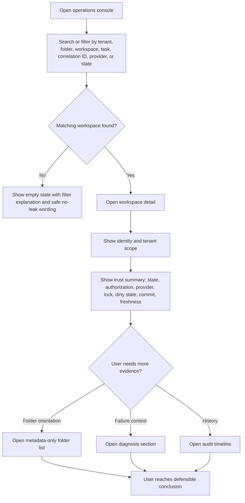
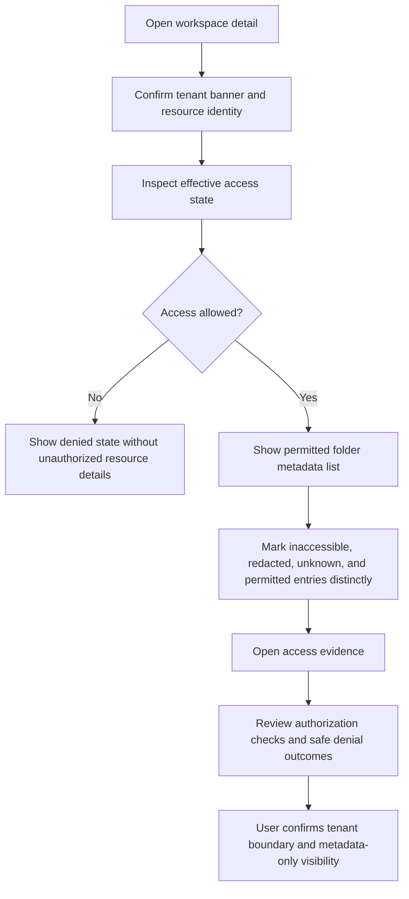
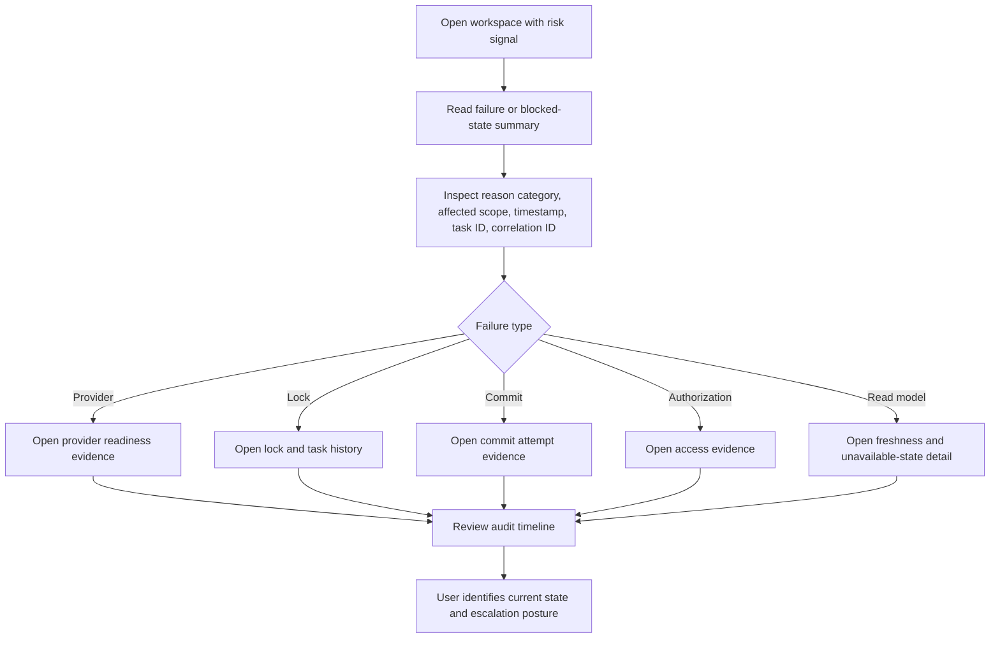

---
stepsCompleted:
  - 1
  - 2
  - 3
  - 4
  - 5
  - 6
  - 7
  - 8
  - 9
  - 10
  - 11
  - 12
  - 13
  - 14
inputDocuments:
  - "D:/Hexalith.Folders/_bmad-output/planning-artifacts/product-brief-Hexalith.Folders.md"
  - "D:/Hexalith.Folders/_bmad-output/planning-artifacts/prd.md"
  - "D:/Hexalith.Folders/_bmad-output/planning-artifacts/prd-validation-report.md"
  - "D:/Hexalith.Folders/_bmad-output/planning-artifacts/research/technical-frontcomposer-integration-for-hexalith-folders-ui-research-2026-05-11.md"
  - "D:/Hexalith.Folders/_bmad-output/project-context.md"
  - "D:/Hexalith.Folders/Hexalith.FrontComposer/_bmad-output/project-context.md"
  - "D:/Hexalith.Folders/Hexalith.EventStore/_bmad-output/project-context.md"
workflowType: "ux-design"
projectName: "Hexalith.Folders"
userName: "Jerome"
date: "2026-05-11"
status: "complete"
lastStep: 14
completedAt: "2026-05-11"
implementationReadinessPatchedAt: "2026-05-12"
completedArtifacts:
  uxDesignSpecification: "D:/Hexalith.Folders/_bmad-output/planning-artifacts/ux-design-specification.md"
  designDirections: "D:/Hexalith.Folders/_bmad-output/planning-artifacts/ux-design-directions.html"
---

# UX Design Specification Hexalith.Folders

**Author:** Jerome
**Date:** 2026-05-11

---

<!-- UX design content will be appended sequentially through collaborative workflow steps -->

## Executive Summary

### Project Vision

Hexalith.Folders provides a tenant-scoped workspace control plane for production AI agents that need to prepare, modify, commit, and inspect Git-backed project workspaces without owning filesystem, Git provider, credential, locking, recovery, or audit mechanics. From a UX perspective, the MVP interface is a read-only operations console focused on workspace trust, readiness, failure visibility, and cross-surface status parity.

### Target Users

The primary users are chatbot and agent developers who need confidence that agentic file work is production-ready. Secondary users are platform operators who diagnose provider, workspace, lock, commit, and synchronization failures. Tenant administrators need evidence that access, credentials, repositories, locks, files, and audit metadata remain isolated across tenants.

### Key Design Challenges

The UX must make complex lifecycle states understandable without exposing mutation or repair controls in MVP. It must show provider readiness, workspace state, lock state, dirty state, failed operations, commit evidence, and audit metadata while preventing file-content, diff, credential, secret, and unauthorized-resource leakage. It must clearly distinguish redacted, unknown, missing, inaccessible, delayed, and failed information.

### Design Opportunities

The core UX opportunity is a workspace trust surface that quickly answers what is broken, who or what is affected, and what can safely happen next. FrontComposer projection-driven screens can provide a consistent shell and generated read-only views while Hexalith.Folders preserves strict tenant, metadata-only, and read-only MVP boundaries.

## Core User Experience

### Defining Experience

The core experience is finding a tenant-scoped workspace quickly and understanding whether its folder, workspace, provider, lock, commit, and audit state are safe to trust. The primary interaction starts with search or navigation to a tenant, folder, repository binding, workspace, or task, then lands the user on a read-only workspace trust view.

The console succeeds when an operator or tenant administrator can locate the right workspace, confirm which tenant it belongs to, inspect its current lifecycle state, and understand whether agentic file work is ready, blocked, failed, dirty, locked, inaccessible, or committed.

### Platform Strategy

The MVP UX is a web/desktop experience built through Hexalith.FrontComposer. It is mouse and keyboard first, optimized for operators, developers, and tenant administrators using a browser during diagnostics, readiness checks, and audit review.

The interface should prioritize dense but readable operational information, table and detail layouts, keyboard-accessible navigation, visible focus states, and WCAG 2.2 AA expectations. Mobile and touch are not primary MVP design targets.

### Effortless Interactions

Finding a workspace should require minimal effort. Users should be able to search, filter, or navigate by tenant, folder, repository binding, workspace, task, correlation ID, provider, state, and recent failure indicators.

Proving tenant isolation should be explicit rather than hidden in implementation details. The UI should make tenant scope, effective access state, authorization outcome, and safe denial evidence visible without exposing unauthorized resource existence.

Users should be able to see a bounded, metadata-only folder content list or tree for authorized folders. This list supports trust and orientation by showing permitted paths and file metadata, while excluding file contents, raw diffs, secret material, credential values, and unauthorized paths.

### Critical Success Moments

The first success moment is locating the correct workspace and seeing a trustworthy status summary without needing logs, direct filesystem access, Git commands, or provider consoles.

The strongest trust moment is proving that tenant boundaries are enforced: the user can see the current tenant scope, effective access, permitted folder metadata, and denied or inaccessible states without leakage.

A make-or-break moment is failure diagnosis. If a workspace is blocked, failed, locked, dirty, inaccessible, or delayed, the console must show a stable reason category, affected scope, correlation/task metadata, retry or escalation posture, and last known safe state.

### Experience Principles

- Find first, then diagnose: workspace discovery is the entry point to every operational workflow.
- Tenant scope is always visible: users should never wonder which tenant, folder, repository, task, or authorization context they are inspecting.
- Metadata is useful, contents are protected: folder lists and status evidence may orient the user, but file contents, diffs, credentials, secrets, and unauthorized resources remain hidden.
- Read-only means trustworthy: the MVP console should explain state and evidence without offering mutation, repair, file editing, or hidden operational side effects.
- Fail closed with clarity: inaccessible, redacted, unknown, missing, failed, and delayed states must be visually and semantically distinct.

### Stable UX Design Requirements

These identifiers are the authoritative UX-DR traceability set for Epic 6 and release evidence. `docs/ux/ops-console-wireflows.md` may expand them into screen-level flows, but it must preserve these IDs.

| ID | Requirement |
| --- | --- |
| UX-DR1 | Build the MVP UI as a web/desktop-first operations console through Hexalith.FrontComposer Shell and Microsoft Fluent UI Blazor; do not introduce a separate component library or custom design system. |
| UX-DR2 | Make workspace discovery the primary entry point with global search and state-first filters for tenant, folder, workspace ID, repository binding, task ID, correlation ID, provider, lifecycle state, failure category, and time window. |
| UX-DR3 | Use a resource-detail console structure where search results lead to a workspace detail page anchored by tenant scope, resource identity, authorization posture, and current trust state. |
| UX-DR4 | Keep tenant, folder, repository binding, workspace, provider, task, and authorization context visible before detailed evidence in workspace, folder, provider, access, and audit views. |
| UX-DR5 | Implement a Workspace Trust Summary component on every workspace detail page showing tenant, folder, workspace ID, repository binding, provider, task ID, correlation ID, current state, authorization posture, lock state, dirty state, commit reference, latest reason category, and freshness timestamp. |
| UX-DR6 | Implement a Tenant Scope Banner component showing safe tenant identifier, effective access state, principal or delegated actor summary, policy scope, and last authorization check. |
| UX-DR7 | Implement a Metadata-Only Folder Tree or table that shows permitted path metadata, type, policy-safe size metadata or size class, last known operation, changed-path status, accessibility state, and redaction marker without exposing file contents or raw diffs. |
| UX-DR8 | Implement a Diagnostic Timeline component for diagnosis and audit views showing timestamp, event category, actor/task/correlation metadata, result, state transition, reason category, retry or escalation posture, and safe detail text. |
| UX-DR9 | Implement a Trust Matrix component comparing tenant boundary, provider readiness, workspace lifecycle, lock state, folder metadata visibility, and audit traceability with state label, icon, reason summary, last updated time, and link to supporting evidence. |
| UX-DR10 | Implement a Redaction And Inaccessibility State component that distinguishes redacted, inaccessible, denied, unknown, missing, unavailable, stale, and failed data. |
| UX-DR11 | Preserve the MVP read-only boundary in every UI flow: no mutation controls, repair actions, file editing, raw diff display, credential reveal, unrestricted file browsing, or unauthorized resource confirmation. |
| UX-DR12 | Present folder metadata only as orientation and evidence; never make the console feel like a file manager or content browser. |
| UX-DR13 | Use canonical state vocabulary consistently across search results, trust summaries, tables, timelines, detail panels, empty states, denied states, and redaction states. |
| UX-DR14 | Every status indicator must include readable text, icon or shape cue, semantic color, accessible label, and optional tooltip or detail link when meaning is not obvious; color must never be the only signal. |
| UX-DR15 | Visually and semantically distinguish ready, locked, dirty, committed, failed, inaccessible, delayed, unknown, redacted, stale, missing, unavailable, denied, and archived states. |
| UX-DR16 | Use restrained Fluent UI-based visual foundations: neutral surfaces, high-contrast text, semantic status colors, compact typography, and an 8px spacing base suitable for dense operational work. |
| UX-DR17 | Use cards only for distinct repeated items, summary blocks, and focused panels; avoid nested cards and decorative section cards. |
| UX-DR18 | Structure workspace detail pages with predictable sections for overview, folder metadata, diagnosis, audit trail, provider readiness, lock/task history, and access evidence. |
| UX-DR19 | Make current diagnosis and historical audit evidence connected from the workspace page rather than forcing users into disconnected pages for related evidence. |
| UX-DR20 | Provide safe empty states that distinguish no matches, insufficient filter scope, unavailable read model, and denied access without leaking unauthorized resource existence. |
| UX-DR21 | Provide denied states with safe reason category, allowed correlation ID evidence, and escalation posture without confirming unauthorized resource existence beyond policy. |
| UX-DR22 | Provide redacted states that are visibly different from missing, unknown, unavailable, failed, and denied data; redaction must not be silently hidden or represented as truncation. |
| UX-DR23 | Limit forms to search, filtering, sorting, and view preferences; forms must not submit domain mutations. |
| UX-DR24 | Use dialogs only for read-only detail expansion, safe identifier copy confirmation, filter configuration, and explanatory evidence; dialogs must trap focus, restore focus on close, and have accessible titles. |
| UX-DR25 | Preserve layout stability during loading states and label what is loading: search results, workspace summary, folder metadata, provider readiness, audit timeline, or access evidence. |
| UX-DR26 | Show stale or delayed data with freshness timestamps and read-model status; do not present stale evidence as current without labeling it. |
| UX-DR27 | Display safe identifiers such as task ID, operation ID, correlation ID, commit reference, and credential reference identifier in monospace with safe copy affordances only. |
| UX-DR28 | Support desktop-first layouts with persistent navigation, global search, trust summaries, multi-column evidence panels, metadata tables, and side-by-side diagnosis or audit sections. |
| UX-DR29 | Provide tablet and mobile fallback layouts that stack evidence panels, collapse persistent navigation, preserve search and filters, prioritize tenant/workspace/state/risk signal, and do not break core lookup or high-level trust review. |
| UX-DR30 | Target WCAG 2.2 AA with keyboard access for search, filters, result selection, tabs, tables, tree expansion, detail panels, and dialogs; visible focus; semantic headings and landmarks; accessible names; sufficient contrast; zoom resilience; and screen-reader meaningful redaction/denial/status labels. |
| UX-DR31 | Test the UI at desktop, tablet, and mobile fallback widths, at 125%, 150%, and 200% browser zoom, and with dense identifiers and long paths in tables, timelines, metadata trees, and trust summaries. |
| UX-DR32 | Validate accessibility with automated checks, keyboard-only walkthroughs for the three critical journeys, screen reader review, forced-colors/high-contrast checks where supported, color-blindness review, and focus management checks. |

## Desired Emotional Response

### Primary Emotional Goals

The primary emotional goals are confidence and certainty. Users should feel that they have found the correct workspace, are looking at the correct tenant scope, and can trust the displayed operational state.

The console should reduce anxiety around agentic file work by replacing uncertainty with clear evidence: tenant identity, effective access, workspace state, lock state, provider readiness, commit status, failure reason, and metadata-only folder contents.

### Emotional Journey Mapping

On first use, users should feel oriented rather than overwhelmed. The interface should make the search and discovery path obvious: find a workspace, confirm tenant scope, then inspect status and evidence.

During the core experience, users should feel in control. Workspace state, tenant boundaries, authorization outcomes, and folder metadata should be visible without requiring logs, Git commands, provider consoles, or filesystem access.

After completing a diagnostic or audit task, users should feel certain enough to explain what happened, who or what was affected, what state the workspace is in, and whether the evidence proves safe isolation.

When something goes wrong, users should feel guided rather than stuck. The UI should show stable reason categories, timestamps, affected scope, correlation/task identifiers, retry or escalation posture, and last known safe state.

On return visits, users should feel that the console is predictable: the same states, labels, evidence hierarchy, and authorization boundaries behave consistently across tenants and workspaces.

### Micro-Emotions

Confidence matters when users locate the correct workspace and see a clear trust summary.

Certainty matters when users need to prove tenant isolation, confirm effective access, and distinguish permitted folder metadata from inaccessible or redacted data.

Safe visibility matters when users inspect folder content lists. They should feel they can orient themselves without risking exposure of file contents, diffs, secrets, credentials, or unauthorized paths.

Accountability matters when users review task history, audit records, changed-path metadata, commits, denials, and failures.

Relief matters when a failure state is understandable and bounded rather than mysterious.

### Design Implications

Confidence requires strong workspace identity cues: tenant, folder, repository binding, workspace, task, provider, state, and timestamp should be visible near the top of diagnostic views.

Certainty requires evidence hierarchy. The UI should separate current state, reason category, supporting metadata, audit trail, and folder content list so users can explain the outcome.

Operational diagnosis and audit trail should reinforce each other. Diagnostic views should answer what is happening now, while audit views explain how the workspace reached that state.

Folder content lists should support safe visibility, orientation, and accountability. They should show bounded metadata such as path, type, size or policy-limited size class, last known operation, changed-path status, and accessibility state, while excluding file contents and diffs.

Negative emotions to avoid include confusion, suspicion, accidental exposure anxiety, and helplessness after failures.

### Emotional Design Principles

- Confidence before detail: every workspace view should first establish identity, state, and trust posture.
- Certainty through evidence: users should be able to support operational and audit conclusions with visible metadata.
- Diagnosis and audit work together: current status and historical evidence should be connected, not isolated.
- Safe visibility: folder content lists should orient users while preserving metadata-only boundaries.
- Calm failure handling: failed, blocked, inaccessible, redacted, unknown, and delayed states should be explicit and actionable without causing alarm.

## UX Pattern Analysis & Inspiration

### Inspiring Products Analysis

Azure Portal is a strong reference for resource-scoped operational diagnosis. Its useful pattern is the resource detail model: users find a resource, confirm its identity and scope, then inspect status, configuration, access, activity, and diagnostics from a consistent left-navigation structure. Hexalith.Folders should adapt this resource-first pattern for tenants, folders, repositories, workspaces, tasks, providers, and audit records.

GitHub is a useful reference for repository and file orientation. Its strongest transferable patterns are repository identity, branch/ref visibility, file tree scanning, commit references, changed-path metadata, and activity context. Hexalith.Folders should borrow the orientation value of a file tree while preserving its stricter metadata-only boundary.

Sentry is a useful reference for failure triage. Its strongest pattern is grouping a failure around what happened, where it happened, when it started, how often it occurs, what is affected, and what evidence supports the diagnosis. Hexalith.Folders should adapt this for workspace, provider, lock, commit, authorization, and read-model failures.

Grafana and Datadog are useful references for operational filtering and status surfaces. Their strongest patterns are dense dashboards, state filters, scoped time windows, event timelines, health indicators, and drill-down from summary to evidence. Hexalith.Folders should adapt these patterns without becoming a metrics product.

### Transferable UX Patterns

Resource-first navigation should anchor the product. Users should start by finding a workspace or related resource, then drill into scoped status, folder metadata, provider readiness, task history, audit evidence, and failure diagnostics.

A trust summary should sit at the top of workspace detail views. It should show tenant, folder, workspace, provider, repository binding, current state, last updated time, authorization posture, and the most important reason category.

A bounded metadata file tree should provide orientation. It should show permitted paths, type, policy-safe size metadata, changed-path status, and accessibility state without exposing file contents, raw diffs, or unauthorized paths.

A diagnostic timeline should connect operational diagnosis and audit trail. Users should be able to see readiness checks, lock events, file-operation metadata, commit attempts, denials, failures, retries, and status transitions in one ordered view.

Filtering should be state-first. Users should quickly filter by tenant, provider, folder, workspace state, lock state, dirty state, failure category, task ID, correlation ID, and time window.

### Anti-Patterns to Avoid

Avoid a generic admin dashboard that shows many counts but does not help users find a workspace or prove tenant isolation.

Avoid a file-manager experience. The console may show folder metadata lists, but it must not invite users to browse file contents, edit files, inspect raw diffs, or treat the UI as the agent workspace.

Avoid hiding scope. Tenant, folder, repository, workspace, task, provider, and authorization context must not disappear as users move between views.

Avoid color-only state communication. Readiness, failure, lock, redaction, inaccessible, unknown, and delayed states need text labels, icons, and accessible semantics.

Avoid log-wall diagnosis. The user should not need to read raw logs to understand the current state, failure reason, affected scope, or audit evidence.

### Design Inspiration Strategy

Adopt Azure Portal's resource-detail pattern for workspace-centered navigation and diagnosis.

Adapt GitHub's file tree and commit orientation into a metadata-only folder content list with no file-content or diff exposure.

Adapt Sentry's failure grouping into stable workspace failure summaries with reason category, affected scope, timestamps, correlation/task identifiers, and last known safe state.

Adapt Grafana and Datadog's filtering and timeline patterns for operational evidence, while keeping the product focused on workspace trust rather than broad observability.

Avoid consumer-style delight, decorative dashboards, and mutation-heavy admin controls. The MVP should feel calm, precise, and evidence-driven.

## Design System Foundation

### 1.1 Design System Choice

Hexalith.Folders should use Hexalith.FrontComposer Shell as the UI framework and Microsoft Fluent UI Blazor as the component foundation. The MVP should not create a custom design system or introduce a second UI component library.

This choice supports a web/desktop, mouse-and-keyboard-first operations console with read-only, projection-driven views for workspace discovery, tenant isolation evidence, folder metadata lists, provider readiness, failure diagnosis, and audit trails.

### Rationale for Selection

FrontComposer is already the intended integration path for the Hexalith.Folders UI and provides the shell, projection-driven UI model, Fluxor state conventions, and generated-view foundation needed for a metadata-only operations console.

Fluent UI Blazor fits the product's emotional goals: calm, precise, accessible, and operational rather than decorative. It provides familiar enterprise controls for tables, navigation, commands, dialogs, menus, tabs, status indicators, and forms while staying aligned with the existing Hexalith.FrontComposer stack.

A custom design system would add unnecessary cost and risk. A separate established system such as Material, Ant Design, or Tailwind UI would conflict with the existing FrontComposer and Fluent UI direction.

### Implementation Approach

The UI should be implemented as a Blazor Web App host rendering FrontComposerShell as the primary layout. FrontComposer projection models should drive read-only workspace, folder, provider, task, audit, and status views.

The design should prioritize resource-first navigation, state-first filtering, trust summaries, diagnostic timelines, and bounded metadata file trees. Fluent UI components should be used for tables, navigation, tabs, breadcrumbs, badges, dialogs, tooltips, menus, command bars, empty states, and accessible status displays.

Mutation components, repair actions, file editing, raw diff inspection, credential reveal, and unrestricted file browsing are excluded from the MVP design system usage.

### Customization Strategy

Customization should be restrained and token-based. The UI should use FrontComposer and Fluent UI defaults where possible, then define Hexalith.Folders-specific presentation patterns for workspace trust summaries, tenant scope banners, failure reason blocks, authorization evidence, redaction states, metadata-only folder trees, and diagnostic timelines.

Visual language should emphasize confidence and certainty through clear hierarchy, stable labels, accessible icons, text-backed status indicators, and consistent state vocabulary. Color must never be the only signal for readiness, failure, lock, dirty, inaccessible, redacted, unknown, or delayed states.

Custom components should be introduced only when they express domain-specific evidence patterns that Fluent UI does not provide directly.

## 2. Core User Experience

### 2.1 Defining Experience

The defining experience is: find a workspace, prove its tenant boundary, then understand its trust state from evidence.

A user starts by searching or filtering for a workspace, folder, tenant, repository binding, task, correlation ID, provider, or failure state. They land on a workspace trust view that immediately confirms tenant scope, resource identity, current state, authorization posture, and latest operational evidence.

If this interaction works, the rest of the console follows naturally. Users can diagnose failures, review audit history, inspect metadata-only folder contents, validate provider readiness, and confirm task outcomes because they are anchored to the correct workspace and tenant boundary.

### 2.2 User Mental Model

Users approach the console as an operational diagnosis and audit tool. They are not trying to edit files, repair workspaces, or run Git commands from the UI. They are trying to answer: did the agent work in the right tenant, what workspace did it affect, what happened, what state is it in now, and what evidence proves that?

Their existing mental models come from cloud resource portals, repository views, incident tools, and audit trails. They expect to search for a resource, open a detail page, see a status summary, drill into evidence, and filter timelines or related records.

Confusion is likely if the UI hides tenant scope, makes file metadata feel editable, collapses distinct states into vague status labels, or separates current diagnosis from historical audit evidence.

### 2.3 Success Criteria

The core experience succeeds when users can find the correct workspace quickly, confirm tenant scope without ambiguity, and understand the current trust state without leaving the console.

Users should be able to explain the workspace state using visible evidence: tenant, folder, repository binding, provider, task, lock, dirty state, commit reference, failure category, authorization outcome, folder metadata list, timestamps, and audit timeline.

The interaction should feel successful when users can say: this is the correct workspace, this is the tenant boundary, this is what the agent touched, this is the current state, and this is the evidence.

### 2.4 Novel UX Patterns

The UX mostly uses established patterns: resource search, scoped detail pages, status summaries, filtered tables, metadata trees, and audit timelines. The novel combination is the workspace trust view, which merges operational diagnosis, tenant-isolation evidence, metadata-only folder orientation, and audit history into one resource-centered experience.

This pattern should not require heavy user education because it uses familiar cloud portal and repository metaphors. The product-specific twist is the strict metadata-only boundary and the explicit distinction between permitted, redacted, inaccessible, unknown, failed, delayed, dirty, locked, and committed states.

### 2.5 Experience Mechanics

The interaction starts with global workspace search and state-first filters. Users can search by tenant, folder, workspace, repository binding, task ID, correlation ID, provider, state, or failure category.

Search results should show enough context to choose safely: tenant, folder, workspace, provider, current state, last updated time, and highest-priority risk signal.

Opening a workspace should reveal a trust summary first. The summary should show resource identity, tenant scope, authorization posture, current state, provider readiness, lock state, dirty state, last commit reference, latest failure reason, and last updated timestamp.

Supporting tabs or sections should provide folder metadata list, diagnostic timeline, provider/readiness evidence, task and lock history, audit records, and access/authorization evidence.

Feedback should be immediate and explicit. Empty states, denied states, redacted states, stale read-model states, failed provider states, and unavailable data states must each explain what is known, what is not shown, and why.

Completion happens when the user can leave the view with a defensible conclusion: the workspace is safe, blocked, failed, inaccessible, dirty, locked, committed, or delayed, with evidence attached.

## Visual Design Foundation

### Color System

The visual foundation should use a restrained Fluent UI-based color system with neutral surfaces, high-contrast text, and semantic status colors. The palette should support confidence, certainty, and calm operational diagnosis.

Primary color should be used sparingly for navigation focus, selected states, and primary orientation cues. Neutral backgrounds should dominate the application so tables, status summaries, timelines, and metadata lists remain readable during repeated operational use.

Semantic colors must be reserved for meaning:

- Success or ready: workspace is ready, committed, synchronized, or policy-valid.
- Warning: workspace is dirty, delayed, stale, near lock expiry, or requires attention.
- Error: workspace is failed, provider readiness failed, commit failed, or access is denied.
- Info: workspace is preparing, locked, pending, or in progress.
- Neutral: unknown, unavailable, not configured, redacted, archived, or inactive.

Color must never be the only state signal. Every status needs a text label, icon, tooltip or detail text, and accessible semantic markup.

### Typography System

Typography should follow Fluent UI defaults unless FrontComposer defines a stronger local standard. The tone should be professional, compact, and readable for long diagnostic sessions.

The type system should favor clear hierarchy over expressive typography:

- Page title: resource name and primary workspace identity.
- Section heading: workspace trust summary, folder metadata, provider readiness, audit trail, access evidence.
- Body text: status explanations, reason categories, policy notes, timestamps, and supporting metadata.
- Monospace text: IDs, correlation IDs, task IDs, commit references, provider references, and technical identifiers.

Text density should support scanning. Long prose should be avoided in the primary UI; diagnostic explanations should be concise, structured, and expandable when needed.

### Spacing & Layout Foundation

The layout should be dense and efficient, using an 8px spacing base with compact table and detail patterns appropriate for operational tools. The UI should feel organized, not sparse.

Primary pages should use a resource-detail layout:

- Persistent app shell and navigation from FrontComposer.
- Search and filter entry points for workspace discovery.
- Workspace trust summary near the top of detail pages.
- Tabs or section navigation for folder metadata, diagnosis, audit, access evidence, provider readiness, and task history.
- Tables and timelines for evidence-heavy content.

Cards should be used only for distinct repeated items, summary blocks, and focused panels. Avoid nested cards and decorative section cards. Page structure should rely on clear headings, dividers, spacing, and tables.

### Accessibility Considerations

The UI must target WCAG 2.2 AA. Operators must be able to use keyboard navigation for search, filtering, table scanning, tab navigation, and detail review.

Status indicators must not rely on color alone. Each status must include readable text, an icon or shape cue, and accessible labels.

The UI must preserve visible focus states, semantic headings, readable table structures, sufficient contrast, and usable layouts at common browser zoom levels.

Redacted, inaccessible, unknown, unavailable, failed, delayed, dirty, locked, ready, and committed states must be visually and semantically distinct.

## Design Direction Decision

### Design Directions Explored

The design direction showcase was generated at `D:/Hexalith.Folders/_bmad-output/planning-artifacts/ux-design-directions.html`.

Six directions were explored:

- Resource Detail Console: Azure Portal-style scoped resource page with persistent navigation, workspace identity, trust summary, tabs, and evidence tables.
- Finder Split View: search-led workspace discovery with a result list and live detail pane.
- Trust Matrix: compact evidence matrix focused on tenant boundary, provider readiness, workspace lifecycle, lock, folder metadata, and audit traceability.
- Audit Timeline First: incident-review flow where current state is explained through ordered operational evidence.
- Provider Readiness Console: platform-engineering view centered on provider, credential, repository binding, and affected workspace health.
- Dark Operations Mode: optional dark variant for teams accustomed to monitoring tools and high-density operational views.

### Chosen Direction

The chosen direction is Resource Detail Console as the base structure, with selected elements from Finder Split View, Trust Matrix, and Audit Timeline First.

The MVP should use a resource-centered workspace detail layout: global search and state-first filters lead users to a workspace; the workspace detail page opens with identity, tenant scope, authorization posture, and a trust summary; supporting sections expose folder metadata, diagnosis, provider readiness, access evidence, and audit history.

### Design Rationale

Resource Detail Console best matches the product's core interaction: find a workspace, prove its tenant boundary, then understand its trust state from evidence.

Finder Split View contributes the discovery model: users need fast search and filtering by tenant, folder, workspace, repository binding, task ID, correlation ID, provider, state, and failure category.

Trust Matrix contributes the evidence model: tenant boundary, provider readiness, workspace lifecycle, lock state, metadata visibility, and audit traceability should be comparable at a glance.

Audit Timeline First contributes the diagnostic model: current state should be backed by ordered metadata-only evidence so operators can explain what happened without reading raw logs.

The other directions are useful as secondary patterns but should not become the primary MVP structure. Provider Readiness Console is a focused subview, not the whole product. Dark Operations Mode can be deferred as a theme option.

### Implementation Approach

Implement a FrontComposer Shell web/desktop console with a persistent navigation shell, global workspace search, state-first filters, and resource detail pages.

The primary workspace detail page should include:

- Workspace trust summary with tenant, folder, repository binding, provider, task, state, authorization posture, lock state, dirty state, commit reference, failure reason, and freshness timestamp.
- Metadata-only folder content list with bounded path metadata, type, accessibility state, and changed-path status.
- Diagnostic evidence section for current failures, blocked states, stale data, lock conflicts, provider readiness issues, and commit outcomes.
- Audit timeline connecting authorization checks, readiness checks, lock events, file metadata changes, commit attempts, denials, retries, and status transitions.
- Access evidence view showing effective permission state and safe denial outcomes without leaking unauthorized resource existence.

Use Fluent UI components for navigation, search, filters, command bars, tabs, tables, badges, tooltips, dialogs, empty states, and accessible status indicators. Custom components should be limited to workspace trust summary, trust matrix, metadata-only folder tree, diagnostic timeline, and redaction/inaccessibility states.

## User Journey Flows

### Journey 1: Find Workspace And Inspect Trust State

This is the primary flow. The user starts from global search or state filters, selects the correct workspace, confirms tenant scope, and reads the trust summary before drilling into evidence.

### Journey 2: Prove Tenant Isolation And Safe Folder Visibility

This flow supports tenant administrators and operators who need proof that the displayed workspace belongs to the right tenant and that folder visibility respects policy.

### Journey 3: Diagnose Workspace Failure From Evidence

This flow supports operators diagnosing failed, blocked, dirty, locked, delayed, or inaccessible workspaces.

### Journey Patterns

- Search first: every journey should be reachable from global search and state-first filters.
- Scope before detail: tenant, folder, workspace, task, provider, and authorization context must appear before supporting evidence.
- Summary before tables: users should see the current trust conclusion before scanning detailed metadata.
- Evidence drill-down: diagnosis, audit, access, provider readiness, lock history, and folder metadata should be connected from the workspace page.
- Safe empty and denied states: no-result, denied, redacted, inaccessible, unavailable, and unknown states must avoid resource leakage.

### Flow Optimization Principles

- Minimize steps from search to trust summary.
- Keep the workspace detail page as the anchor for diagnosis and audit.
- Use consistent state labels across search results, summaries, tables, and timelines.
- Prefer bounded metadata lists over file browsing.
- Make failure reasons stable, filterable, and traceable to task and correlation identifiers.

## Component Strategy

### Design System Components

Hexalith.Folders should use FrontComposer Shell and Fluent UI Blazor for standard interface components.

Use existing system components for:

- Application shell and navigation.
- Global search and filter inputs.
- Command bars for non-mutating view controls.
- Tabs and section navigation.
- Tables, lists, and data grids.
- Badges, labels, status indicators, icons, and tooltips.
- Dialogs for read-only detail expansion.
- Empty states, loading states, and error states.
- Breadcrumbs and resource identity headers.

These components cover the general operational-console structure. Custom work should be reserved for domain-specific evidence displays that Fluent UI does not model directly.

### Custom Components

#### Workspace Trust Summary

**Purpose:** Establish workspace identity, tenant scope, and current trust posture at the top of a workspace detail view.

**Usage:** Use on every workspace detail page before folder metadata, diagnosis, audit, or access evidence.

**Anatomy:** Tenant, folder, workspace ID, repository binding, provider, task ID, correlation ID, current state, authorization posture, lock state, dirty state, commit reference, latest reason category, and freshness timestamp.

**States:** Ready, locked, dirty, committed, failed, inaccessible, delayed, unknown, redacted, stale.

**Accessibility:** Each state requires text, icon, and accessible label. Color is supplemental only.

#### Tenant Scope Banner

**Purpose:** Keep tenant and authorization context visible as users move through evidence views.

**Usage:** Use on workspace, folder, provider, access, and audit pages.

**Anatomy:** Tenant name or safe identifier, effective access state, principal/delegated actor summary, policy scope, and last authorization check.

**States:** Allowed, denied, partial, redacted, unknown, stale.

**Accessibility:** Must be keyboard reachable and screen-reader meaningful. Denied states must not expose unauthorized resource existence.

#### Metadata-Only Folder Tree

**Purpose:** Provide safe folder orientation without exposing file contents or raw diffs.

**Usage:** Use for authorized folder and workspace views where users need path-level orientation.

**Anatomy:** Path, type, policy-safe size metadata or size class, last known operation, changed-path status, accessibility state, and redaction marker when applicable.

**States:** Permitted, changed, clean, inaccessible, redacted, unknown, binary, excluded by policy.

**Accessibility:** Tree or table semantics must support keyboard navigation, expansion, collapse, and clear labels for redacted or inaccessible entries.

#### Diagnostic Timeline

**Purpose:** Connect current workspace state to ordered metadata-only operational evidence.

**Usage:** Use on diagnosis and audit views.

**Anatomy:** Timestamp, event category, actor/task/correlation metadata, result, state transition, reason category, retry or escalation posture, and safe detail text.

**States:** Successful, denied, failed, retried, duplicate, pending, stale, unavailable.

**Accessibility:** Timeline must preserve chronological order for assistive technology and not rely on color-coded severity alone.

#### Trust Matrix

**Purpose:** Compare key trust dimensions at a glance.

**Usage:** Use as a compact evidence summary for tenant boundary, provider readiness, workspace lifecycle, lock state, folder metadata visibility, and audit traceability.

**Anatomy:** Dimension name, state label, icon, reason summary, last updated time, and link to supporting evidence.

**States:** Ready, warning, failed, inaccessible, unknown, delayed, redacted.

**Accessibility:** Matrix cells must be reachable and understandable as grouped evidence, not just visual tiles.

#### Redaction And Inaccessibility State

**Purpose:** Standardize how the UI distinguishes redacted, inaccessible, unknown, missing, unavailable, and failed states.

**Usage:** Use anywhere safe visibility boundaries appear, especially folder metadata, audit evidence, provider diagnostics, and access checks.

**Anatomy:** State label, icon, reason category, safe explanation, and optional link to policy or access evidence.

**States:** Redacted, inaccessible, denied, unknown, missing, unavailable, stale, failed.

**Accessibility:** Must communicate the difference between hidden-by-policy and absent data.

### Component Implementation Strategy

Build custom components on top of Fluent UI primitives and FrontComposer conventions. Do not introduce a separate component library.

Custom components should consume semantic state models rather than raw strings wherever possible. State labels, icons, tooltips, and accessibility labels should derive from the same canonical state vocabulary used by API, CLI, MCP, and SDK surfaces.

Components must preserve the MVP boundaries: read-only, metadata-only, no file editing, no raw diffs, no credential reveal, no repair actions, and no unauthorized resource leakage.

### Implementation Roadmap

Phase 1 components:

- Workspace Trust Summary.
- Tenant Scope Banner.
- Metadata-Only Folder Tree.
- Redaction And Inaccessibility State.

Phase 2 components:

- Diagnostic Timeline.
- Trust Matrix.
- Provider Readiness Evidence panel.
- Access Evidence panel.

Phase 3 components:

- Saved workspace filters.
- Cross-surface operation evidence viewer.
- Optional dark operations theme.

## UX Consistency Patterns

### Button Hierarchy

Primary actions should be rare in the MVP because the console is read-only. Use primary buttons only for navigation or view confirmation actions such as opening a selected workspace or applying filters.

Secondary buttons should support non-mutating actions such as clearing filters, changing view mode, opening detail panels, copying safe identifiers, or expanding evidence.

Destructive, repair, mutation, commit, unlock, credential, and file-editing actions must not appear in the MVP console.

Icon buttons should be used for compact table and toolbar actions where the meaning is familiar, with accessible labels and tooltips. Text buttons should be used when the action affects navigation or interpretation.

### Feedback Patterns

Feedback must use canonical state vocabulary and stable reason categories. Status labels should be consistent across search results, workspace summaries, tables, timelines, and detail panels.

Every state indicator must include:

- Text label.
- Icon or shape cue.
- Semantic color.
- Accessible label.
- Optional tooltip or detail link when the meaning is not obvious.

Use success states for ready, committed, synchronized, and policy-valid outcomes. Use warning states for dirty, delayed, stale, near-expiry, and attention-needed outcomes. Use error states for failed, denied, inaccessible, provider-failed, and commit-failed outcomes. Use info states for preparing, locked, pending, and in-progress outcomes. Use neutral states for unknown, unavailable, not configured, redacted, archived, and inactive outcomes.

### Form Patterns

MVP forms should be limited to search, filtering, sorting, and view preferences. They must not submit domain mutations.

Search inputs should support workspace discovery by tenant, folder, workspace ID, repository binding, task ID, correlation ID, provider, state, and failure category.

Filters should be visible, removable, and reflected in result counts. Clearing filters must not change tenant authorization context.

Validation should focus on query syntax, invalid identifiers, unsupported filter combinations, and unsafe query scope. Validation messages must be specific and safe.

### Navigation Patterns

Navigation should be resource-first. Users start from search or filtered lists, then open a workspace detail page.

Workspace detail pages should keep tenant, folder, workspace, provider, task, and authorization context visible. Supporting evidence should be organized into predictable sections: overview, folder metadata, diagnosis, audit trail, provider readiness, lock/task history, and access evidence.

Use tabs or section navigation for evidence views. Do not force users into separate disconnected pages for diagnosis and audit when the evidence belongs to the same workspace.

Breadcrumbs should show safe hierarchy without exposing unauthorized resource names.

### Search And Filtering Patterns

Search is the primary entry point. Results should show enough context to select safely: tenant, folder, workspace, provider, current state, last updated time, and highest-priority risk signal.

Filters should prioritize operational state: ready, dirty, locked, failed, inaccessible, delayed, redacted, unknown, committed, provider, tenant, task, correlation, and time window.

No-result states must distinguish between no matches, insufficient filter scope, unavailable read model, and denied access without leaking unauthorized resource existence.

### Empty, Denied, And Redacted States

Empty states should explain what is known and what the user can safely do next, such as adjusting filters or checking another tenant scope.

Denied states must not confirm unauthorized resource existence beyond policy. They should show safe reason category, correlation ID when allowed, and escalation posture.

Redacted states must be visually distinct from missing, unknown, unavailable, and failed states. The UI must not silently hide redaction.

### Modal And Overlay Patterns

Use dialogs only for read-only detail expansion, safe identifier copy confirmation, filter configuration, and explanatory evidence details.

Dialogs must not contain mutation, repair, credential reveal, file-content display, or raw diff display.

Prefer inline panels or tabs for primary evidence. Dialogs should not become the main diagnosis path.

### Additional Patterns

Loading states should preserve layout stability and identify what data is loading: search results, workspace summary, folder metadata, provider readiness, audit timeline, or access evidence.

Stale or delayed data must show freshness timestamps and read-model status. Do not present stale evidence as current without labeling it.

Identifier display should use monospace text and copy affordances only for safe identifiers such as task ID, operation ID, correlation ID, commit reference, and credential reference identifier. Copy actions must never expose credential values or secrets.

## Responsive Design & Accessibility

### Responsive Strategy

Hexalith.Folders is a web/desktop-first operational console. The primary experience should target desktop and laptop users working with mouse and keyboard, dense tables, filters, timelines, and resource detail pages.

Desktop layouts should use available width for persistent navigation, global search, trust summaries, multi-column evidence panels, metadata tables, and side-by-side diagnosis or audit sections.

Tablet layouts should preserve the core flow but simplify density. Navigation may collapse, evidence panels should stack, and tables should support horizontal scrolling or priority columns.

Mobile is a fallback, not the primary MVP target. Mobile layouts should support basic workspace lookup and high-level trust-state review, but detailed audit, metadata tree, and diagnosis workflows may require larger screens. The UI should not break on mobile, but feature density should remain optimized for desktop operations work.

### Breakpoint Strategy

Use standard responsive breakpoints unless FrontComposer establishes project-specific values:

- Small/mobile: 320px to 767px.
- Medium/tablet: 768px to 1023px.
- Large/desktop: 1024px and above.
- Wide operations view: 1280px and above.

The implementation can be desktop-first because the primary workflows are operational and evidence-heavy. Components should still degrade predictably for smaller screens.

At small widths:

- Collapse persistent side navigation.
- Stack summary panels.
- Prioritize tenant, workspace, state, and risk signal.
- Hide lower-priority columns behind detail expansion.
- Preserve access to search and filters.

At wide widths:

- Use side navigation, multi-column summaries, visible tabs, and split evidence layouts.
- Keep workspace identity and tenant scope visible while scrolling where practical.

### Accessibility Strategy

The console must target WCAG 2.2 AA.

Accessibility requirements:

- Keyboard access for search, filters, result selection, tabs, tables, tree expansion, detail panels, and dialogs.
- Visible focus indicators on all interactive elements.
- Semantic headings and landmarks for resource detail pages.
- Accessible names for icons, status indicators, filters, copy buttons, and tabs.
- Status indicators that use text and icon or shape cues in addition to color.
- Sufficient contrast for text, borders, status indicators, and focus states.
- Screen-reader meaningful labels for redacted, inaccessible, unknown, unavailable, failed, delayed, dirty, locked, ready, and committed states.
- No motion dependency for understanding state changes.
- Usable zoom behavior at common browser zoom levels.

The UI must clearly distinguish redacted data from unknown, missing, unavailable, failed, and denied states. This is both accessibility and security-critical.

### Testing Strategy

Responsive testing should cover:

- Desktop at 1024px, 1280px, 1440px, and wide-screen widths.
- Tablet width around 768px to 1023px.
- Mobile fallback around 360px and 430px.
- Browser zoom at 125%, 150%, and 200% for key workflows.
- Table, timeline, metadata tree, and trust summary behavior under long identifiers and dense status data.

Accessibility testing should include:

- Automated checks with axe or equivalent tooling.
- Keyboard-only walkthroughs for the three critical journeys.
- Screen reader review for workspace summary, folder metadata list, denied states, redaction states, and audit timeline.
- Forced-colors or high-contrast mode checks where supported.
- Color-blindness review for semantic states.
- Focus management checks for dialogs, tabs, filters, and detail panels.

### Implementation Guidelines

Use semantic HTML and Fluent UI components as the accessibility foundation. Avoid custom interactive elements unless they can match Fluent UI keyboard and ARIA behavior.

Prefer responsive grid and flex layouts over fixed-width layouts. Fixed dimensions are acceptable for stable controls, icon buttons, table columns, and status indicators where layout stability matters.

Tables must remain readable with long tenant names, workspace IDs, correlation IDs, commit references, and paths. Use truncation only when the full value remains available through a safe tooltip, details panel, or copy action.

The metadata-only folder tree must support keyboard navigation and clear expansion/collapse behavior. If a table representation is used instead of a tree, it must preserve hierarchy and accessibility labels.

Dialogs and overlays must trap focus, restore focus on close, and provide accessible titles. They must be limited to read-only detail expansion and safe filter configuration.

All responsive and accessibility work must preserve MVP safety boundaries: read-only, metadata-only, no file contents, no raw diffs, no credential values, no repair actions, and no unauthorized resource leakage.
