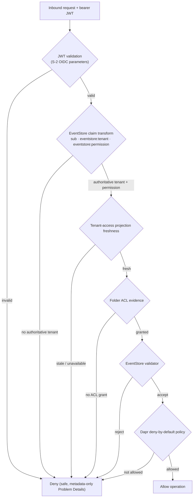

# Tenant / Auth / ACL Layered-Authorization Decision Flow

Status: Story 7.13 consumer reference (metadata-only).

This diagram shows the contractual **layered-authorization order** every request passes through. Authority is
derived from the authenticated context and EventStore claim-transform evidence — never from request payloads,
headers, or query values. Each layer is **deny-by-default**: a failure at any layer denies the request with a
safe, metadata-only Problem Details response. See [authentication guidance](../sdk/authentication.md) for the
claim-provenance contract and the frozen S-2 OIDC parameters.

The order is fixed: **JWT validation → EventStore claim transform → tenant-access projection freshness →
folder ACL → EventStore validator → Dapr deny-by-default policy**. Client-supplied tenant or principal values
(in the payload, headers, or query string) are comparison inputs validated against `eventstore:tenant` /
`sub`; they are never authority and never short-circuit a layer.
