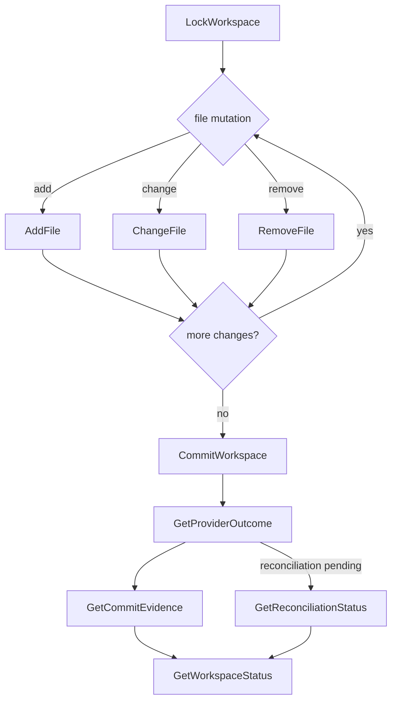

# File Operation → Commit Flow

Status: Story 7.13 consumer reference (metadata-only).

This diagram shows the consumer flow from acquiring a workspace lock through file mutations to commit and
outcome verification. Every node is a canonical spine operation (see the
[API & SDK reference](../sdk/api-reference.md)); no operation appears that is absent from the spine. The
state transitions behind this flow are governed by the
[workspace lifecycle](./workspace-lifecycle.md).

- File mutations (`AddFile`, `ChangeFile`, `RemoveFile`) require the workspace lock and a caller-supplied
  idempotency key and task ID.
- `CommitWorkspace` is idempotency-keyed; `GetProviderOutcome` and `GetCommitEvidence` are read-only.
- When the provider outcome is pending or unknown, consumers poll `GetReconciliationStatus` and
  `GetWorkspaceStatus` rather than retrying the mutation. Results are metadata-only; file bytes never appear.
