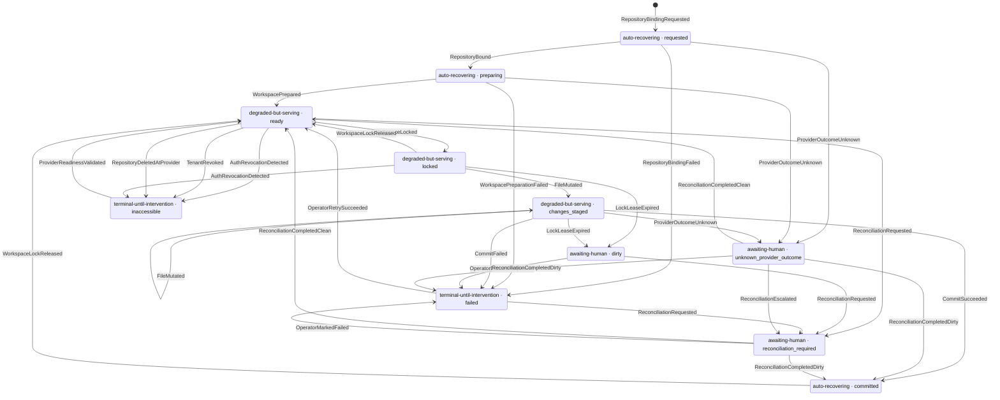

# Workspace Lifecycle & Lock State Machine

Status: Story 7.13 consumer reference (metadata-only).

This diagram renders the canonical **C6 workspace state machine** with **operator-disposition labels as the
primary vocabulary** (per architecture rule F-4) and the technical state name as secondary metadata. States
and events trace 1:1 to
[`docs/exit-criteria/c6-transition-matrix-mapping.md`](../exit-criteria/c6-transition-matrix-mapping.md),
whose source of truth is the architecture Workspace State Transition Matrix (C6 — Enumerated). Every unlisted
`(state, event)` pair rejects with `state_transition_invalid` (CLI exit `74`, MCP failure kind
`state_transition_invalid`) and leaves state unchanged. No spine operation appears as a state or event.

## Operator disposition per state (F-4)

| Technical state | Operator disposition |
|---|---|
| `requested` | `auto-recovering` |
| `preparing` | `auto-recovering` |
| `ready` | available, or `degraded-but-serving` when projection lag exceeds C2 |
| `locked` | `degraded-but-serving` |
| `changes_staged` | `degraded-but-serving` |
| `dirty` | `awaiting-human` |
| `committed` | `auto-recovering` |
| `failed` | `terminal-until-intervention` |
| `inaccessible` | `terminal-until-intervention` |
| `unknown_provider_outcome` | `awaiting-human` |
| `reconciliation_required` | `awaiting-human` |

## State machine

The lock sub-states are `ready` (unlocked, serving), `locked` (held), and `changes_staged` (mutations pending
under the held lock). Lock release returns to `ready`; lease expiry escalates to `dirty` for human
disposition.
