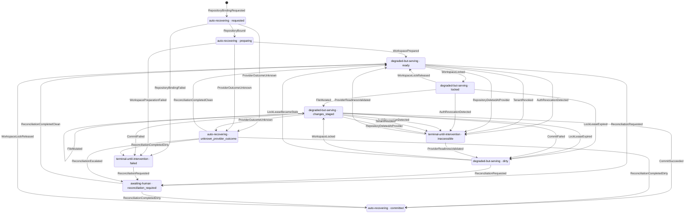

# Workspace Lifecycle & Lock State Machine

Status: PD11 governing target consumer reference; A7/A7b approved on exact decision payloads (metadata-only; Story 4.22 runtime implementation remains deferred).

This diagram renders the canonical **C6 workspace state machine** with **operator-disposition labels as the
primary vocabulary** (per architecture rule F-4) and the technical state name as secondary metadata. States
and events trace 1:1 to
[`docs/exit-criteria/c6-transition-matrix-mapping.md`](../exit-criteria/c6-transition-matrix-mapping.md),
whose source of truth is the architecture Workspace State Transition Matrix (C6 — Enumerated). Every unlisted
`(state, event, guard)` triple rejects with `state_transition_invalid` (CLI exit `74`, MCP failure kind
`state_transition_invalid`) and leaves state unchanged. No spine operation appears as a state or event.

## Operator disposition per state (F-4)

| Technical state | Operator disposition |
|---|---|
| `requested` | `auto-recovering` |
| `preparing` | `auto-recovering` |
| `ready` | available, or `degraded-but-serving` when projection lag exceeds C2 |
| `locked` | `degraded-but-serving` |
| `changes_staged` | `degraded-but-serving` |
| `dirty` | `degraded-but-serving` while the originating task can resume or the workspace is clean, `awaiting-human` once staged changes are orphaned |
| `committed` | `auto-recovering` |
| `failed` | `terminal-until-intervention` |
| `inaccessible` | `terminal-until-intervention` |
| `unknown_provider_outcome` | `auto-recovering` during the bounded ≤5 checks/15-minute reconciliation budget; escalation to `reconciliation_required` becomes `awaiting-human` |
| `reconciliation_required` | `awaiting-human` |

## State machine

```mermaid
stateDiagram-v2
    state "auto-recovering · requested" as requested
    state "auto-recovering · preparing" as preparing
    state "degraded-but-serving · ready" as ready
    state "degraded-but-serving · locked" as locked
    state "degraded-but-serving · changes_staged" as changes_staged
    state "auto-recovering · committed" as committed
    state "degraded-but-serving · dirty" as dirty
    state "awaiting-human · reconciliation_required" as reconciliation_required
    state "auto-recovering · unknown_provider_outcome" as unknown_provider_outcome
    state "terminal-until-intervention · failed" as failed
    state "terminal-until-intervention · inaccessible" as inaccessible

    [*] --> requested : RepositoryBindingRequested
    requested --> preparing : RepositoryBound
    requested --> failed : RepositoryBindingFailed
    requested --> unknown_provider_outcome : ProviderOutcomeUnknown
    preparing --> ready : WorkspacePrepared
    preparing --> failed : WorkspacePreparationFailed
    preparing --> unknown_provider_outcome : ProviderOutcomeUnknown
    ready --> locked : WorkspaceLocked
    ready --> inaccessible : AuthRevocationDetected
    ready --> inaccessible : TenantRevoked
    ready --> inaccessible : RepositoryDeletedAtProvider
    ready --> reconciliation_required : ReconciliationRequested
    locked --> changes_staged : FileMutated
    locked --> ready : WorkspaceLockReleased
    locked --> dirty : LockLeaseExpired
    locked --> inaccessible : AuthRevocationDetected
    changes_staged --> changes_staged : FileMutated
    changes_staged --> committed : CommitSucceeded
    changes_staged --> failed : CommitFailed
    changes_staged --> unknown_provider_outcome : ProviderOutcomeUnknown
    changes_staged --> dirty : LockLeaseExpired
    changes_staged --> dirty : CommitFailed
    changes_staged --> inaccessible : AuthRevocationDetected
    changes_staged --> inaccessible : TenantRevoked
    changes_staged --> inaccessible : RepositoryDeletedAtProvider
    committed --> ready : WorkspaceLockReleased
    dirty --> changes_staged : WorkspaceLocked
    dirty --> ready : LockLeaseBecameStale
    dirty --> reconciliation_required : ReconciliationRequested
    failed --> reconciliation_required : ReconciliationRequested
    inaccessible --> ready : ProviderReadinessValidated
    inaccessible --> dirty : ProviderReadinessValidated
    unknown_provider_outcome --> ready : ReconciliationCompletedClean
    unknown_provider_outcome --> committed : ReconciliationCompletedDirty
    unknown_provider_outcome --> failed : ReconciliationCompletedDirty
    unknown_provider_outcome --> reconciliation_required : ReconciliationEscalated
    reconciliation_required --> ready : ReconciliationCompletedClean
    reconciliation_required --> committed : ReconciliationCompletedDirty
```

The lock sub-states are `ready` (unlocked, serving), `locked` (held), and `changes_staged` (mutations pending
under the held lock). Lock release returns to `ready`; lease expiry moves the workspace to `dirty`.

Per PD11 (2026-09-15), `dirty` is not inherently terminal. The originating server-authorized task re-acquires it to
`changes_staged` under a new lock instance, and a clean `dirty` workspace clears itself to `ready` when the
lease reaches the C7 expired-to-stale boundary (`LockLeaseBecameStale`); only orphaned staged changes are
`awaiting-human`. Five pairs are guard-discriminated (four PD11 pairs plus the existing reconciliation-resolution pair), and the diagram cannot show the guard, so the edge
labels alone do not determine the outcome: `changes_staged`+`CommitFailed` (retryable with no confirmed
remote effect goes to `dirty`, known non-retryable to `failed`), `inaccessible`+`ProviderReadinessValidated`
(staged content before its separate recovery deadline goes to `dirty`; no content goes to `ready`; content after
the deadline rejects until C3 cleanup is eligible and complete), `dirty`+`WorkspaceLocked` (staged content is present
AND `stagedByTaskId` equals the server-resolved task of the re-acquiring command), and `dirty`+`LockLeaseBecameStale` (clean only — a `dirty` workspace holding staged
changes rejects it), plus `unknown_provider_outcome`+`ReconciliationCompletedDirty` (confirmed commit to
`committed`, confirmed refusal to `failed`). `stagedRecoveryStartedAt`/`stagedRecoveryDeadline` bound only
automatic recovery. Destructive cleanup uses separate `stagedCleanupStartedAt`/`stagedCleanupNotBefore`, with
the latter P7D after a terminal/no-active start; legal hold and current terminal/no-active state are rechecked. See
architecture.md §"Workspace State Transition Matrix (C6 — Enumerated)".

`OperatorDiscardRequested`, `OperatorRetrySucceeded`, and `OperatorMarkedFailed` are reserved post-MVP events.
They intentionally have no diagram edges and are absent from the published MVP enum. A negative fixture proves
their reserved identifiers reject with `state_transition_invalid` and leave state unchanged.
