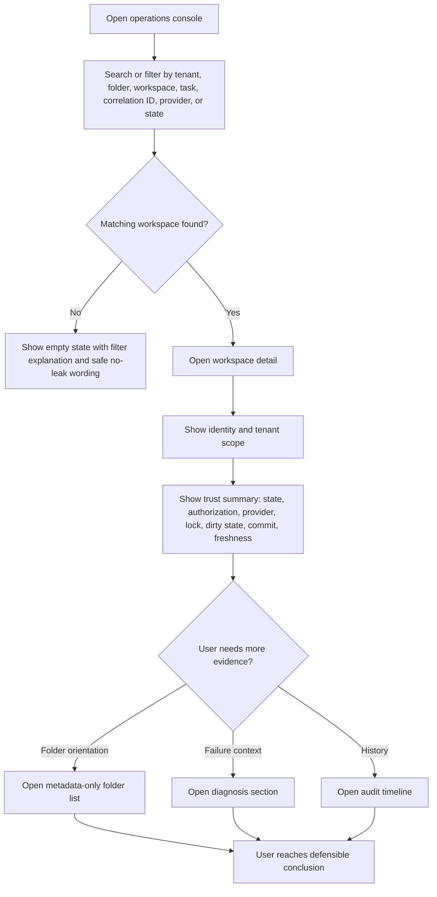
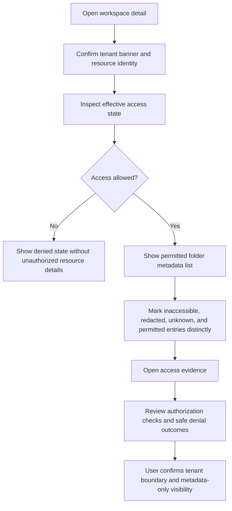
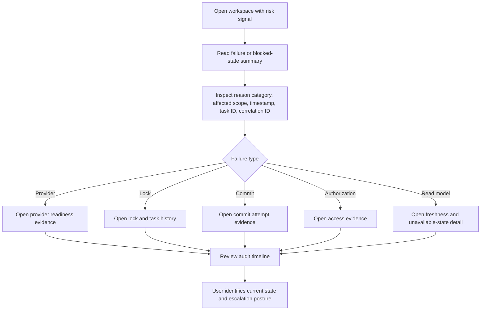

# Operations Console Diagnostic Wireflow Notes

These are lightweight **wireflow notes** — prose, per-state tables, ASCII layout sketches, and
Mermaid flow diagrams — for the primary diagnostic workflows of the Hexalith.Folders read-only
operations console. They are **not** pixel-perfect mockups and **not** a component-API
specification. They capture the reviewed *information hierarchy, interaction states, and
accessibility expectations* so that Stories 6.6–6.10 implement diagnostic pages against a single
reviewed contract instead of each re-deriving the status vocabulary, the redaction-vs-unknown
rule, the read-only boundary, or the FrontComposer composition model.

The notes **describe** what downstream pages must do; they do **not** pre-build those pages. The
components named here as *to-be-built-by their owning story* are created by those stories, not by
Story 6.5.

## Ownership Metadata

- owner_workstream: Operations-console UX design and Epic 6 read-only console stories.
- future_test_use: Reviewed contract for the AC-7 gate review of Stories 6.6–6.10; the per-view
  state-sets, status taxonomy, UX-DR console expectations, and traceability map are the checklist a
  reviewer (and downstream story author) verifies diagnostic pages against. Markdown-presence and
  ID-completeness checks (32 UX-DR IDs, 12 taxonomy terms, 9 state-sets) can be asserted against
  this file.
- known_omissions: No screen-level visual mockups and no component-API signatures beyond names already
  shipped in Stories 6.2–6.4. C3 and C4 governance approvals are now recorded in
  `docs/exit-criteria/`; remaining reference-pending rows in NFR traceability track downstream
  evidence and guard posture only. C2 status-freshness target, `ProjectionAvailability`
  redacted/unknown freeze, French localization, and visual mockups remain owned elsewhere.
- mutation_rules: This document is a reviewed contract. Downstream stories reference and preserve
  its IDs/names verbatim; they do not redefine, re-number, or fork the UX-DR identifiers, the C6
  state names, the operator-disposition labels, or the `FieldDisclosure` members. Changes to the
  shared status taxonomy or the traceability map require updating this file alongside the affected
  story, not silently in the page.
- non_policy_placeholder: false
- synthetic_data_only: true

All example identifiers in this document are **synthetic** (`acme`, `tenant-a`, `folder-123`,
`task-7f3`, `correlation-9ab`). The document contains **no real tenant, folder, repository,
credential, path, or audit data**, consistent with the project metadata-only rule (cross-cutting
concern #6 / #11).

## Scope and Boundary

The operations console is, in MVP:

- **Read-only** — no mutation controls, repair actions, file editing, raw diff display, credential
  reveal, unrestricted file browsing, or unauthorized-resource confirmation in any flow
  (UX-DR11 / F-2 / cross-cutting concern #11).
- **Projection-backed** — it reads only from read-model projections through a read-only data path;
  it never touches EventStore aggregates directly (F-2).
- **Metadata-only** — folder lists, status evidence, and audit records orient the operator; file
  contents, diffs, secrets, credential values, and unauthorized resource existence are never shown
  (cross-cutting concern #11 / FR55 / NFR Security).
- **MVP-bounded** — repair workflows, auto-commit, working-copy repair, and drift-first operations
  views are explicitly out of MVP scope (PRD §Out of Scope).

These notes are a **reviewed contract for Stories 6.6–6.10**, not an implementation. Story 6.5
writes no C# and changes no build/test/contract/SDK artifact. The single product-tree deliverable
is this file.

FR58 note: Memories-backed discovery must reuse these existing operations-console browse/search and
status patterns. It must not introduce folder-content preview, cross-tenant visibility, or an
authorization path outside the Folders query facade.

## Downstream Gate

> **Stories 6.6, 6.7, 6.8, 6.9, and 6.10 cannot begin implementation until
> `docs/ux/ops-console-wireflows.md` exists and has been reviewed against (1) the PRD console
> requirements, (2) architecture decisions F-1 through F-7, (3) the UX design specification, and
> (4) the FrontComposer technical research.**

This is the verbatim intent of the Epic 6 acceptance criterion (`epics.md` line 1382). The four
review sources are enumerated in [References](#references). The
[Gate-Readiness Self-Review](#gate-readiness-self-review) section records the author-side checks
that anchor the reviewer's gate decision.

---

## 1. FrontComposer Hosting Model

Every diagnostic page in Stories 6.6–6.10 sits inside the FrontComposer-hosted shell scaffolded by
Story 6.2. This section fixes the hosting model so downstream pages compose the framework instead
of reinventing it.

### 1.1 Shell layout

- `Hexalith.Folders.UI` is a **Blazor Web App host using Interactive Server rendering** throughout
  (never Static SSR). `MainLayout.razor` collapses to a single line:
  `<FrontComposerShell AppTitle="Hexalith.Folders Operations Console">@Body</FrontComposerShell>` —
  `FrontComposerShell` is the **sole** primary layout.
- The render mode is applied to the routed component tree
  (`app.MapRazorComponents<App>().AddInteractiveServerRenderMode()`); the root `App` component
  itself is not interactive.
- Fluent UI is consumed **through the FrontComposer/Shell pattern**
  (`Microsoft.FluentUI.AspNetCore.Components`), not a separate component library or custom design
  system (UX-DR1, F-3). Restrained foundations: neutral surfaces, high-contrast text, semantic
  status colors, compact typography, 8px spacing base (UX-DR16).
- The shell already provides a skip link
  (`<a class="fc-skip-link" href="#fc-main-content">` in `FrontComposerShell.razor`) and the routed
  shell regions (header with start/center/end slots, navigation sidebar, content, footer). Pages
  **must not** add a competing skip link. Each page renders **exactly one `<h1>`** and relies on the
  shell's `<FocusOnNavigate Selector="h1" />` (Story 6.2) so keyboard focus lands on the page
  heading after navigation.

> **As-built terminology note.** Architecture F-1 (line 545) and the UI source-tree comment
> (line 1173) use the older shorthand **"Blazor Server."** The as-built host and the Story 6.2 epic
> AC are a **"Blazor Web App host using Interactive Server rendering."** These notes use the
> as-built term; downstream pages must not "correct" it back to the looser wording. The two are
> reconciled in [References](#references).

### 1.2 Navigation

- FrontComposer's navigation convention builds nav-item hrefs from the **D2 convention**
  `/{boundedContextLowercase}/{projectionTypeNameKebabCase}` — confirmed in the submodule source
  `FrontComposerNavigation.BuildRoute(boundedContext, projectionFqn)`
  (`$"/{boundedContext.ToLowerInvariant()}/{ToKebab(typeName)}"`). Generated projection pages route
  automatically under this convention, grouped per bounded context.
- Auto-population: projection types marked `[Projection][BoundedContext("Folders")]` are scanned by
  the FrontComposer source generator and populate navigation from the registered domain manifest
  (`AddHexalithFrontComposerQuickstart(o => o.ScanAssemblies(...))`,
  `AddHexalithDomain<FoldersFrontComposerDomain>()`).
- The diagnostic workflows map onto navigation as follows. Pages that are **custom, hand-authored
  Razor** (not generated projection grids) need an explicit nav entry / custom nav slot; pages that
  are generated projection views auto-populate:

  | Workflow | Route (illustrative) | Owning story | Generated or custom |
  | --- | --- | --- | --- |
  | Tenant + folder selection (discovery entry) | `/` and `/tenants` (shipped 6.2) | 6.6 | custom |
  | Folder list / metadata-only tree | `/folders/...` | 6.6 | mixed (grid + custom tree) |
  | Workspace detail (trust summary) | workspace detail page | 6.6 | custom |
  | Provider health / readiness | provider readiness view | 6.7 | mixed |
  | Audit trail / operation timeline | audit + timeline views | 6.8 | mixed (grid + custom timeline) |
  | Incident stream (last resort) | `/_admin/incident-stream` | 6.9 | custom (ACL-gated) |

  Routes above are **illustrative**; each owning story fixes its concrete route and states whether
  it auto-populates from the D2 convention or needs a custom nav slot.

### 1.3 Projection-view composition and override levels

- **Generated read-only projection pages** are emitted as `FluentDataGrid`-backed `.g.cs`/`.g.razor`
  artifacts in `obj/`. They are **framework-owned, auto-routed, and never hand-edited**, and are
  produced from hand-written `[Projection][BoundedContext("Folders")]` POCO DTOs.
- **Custom diagnostic/workflow pages** are hand-authored Razor outside the generated projection
  system (e.g., the workspace trust summary, metadata-only folder tree, diagnostic timeline,
  incident stream).
- **Override levels.** The FrontComposer research describes four conceptual override levels
  (annotation hints → projection template → projection slot → projection view override). The
  **as-built submodule** exposes them as follows — downstream stories must use the as-built
  mechanism, not invent attributes:

  | Level | Purpose | As-built mechanism |
  | --- | --- | --- |
  | 1 — annotation hints | guide code generation on the projection type | attributes on the `[Projection]` DTO |
  | 2 — projection template | typed override of the generated view | **`[ProjectionTemplate]` attribute** (real, in `Hexalith.FrontComposer.Contracts.Attributes`; references Story 6-2 template work) |
  | 3 — projection slot | override a render slot within a view | **descriptor record `ProjectionSlotDescriptor`** + SourceTools/runtime registry — **not** a user-applied `[ProjectionSlot]` attribute |
  | 4 — projection view override | replace a generated view wholesale | **descriptor record `ProjectionViewOverrideDescriptor`** + registry — **not** a user-applied `[ProjectionViewOverride]` attribute |

  Confirmed attribute surface in the submodule: `[Projection]`, `[BoundedContext]`, `[Command]`,
  `[ProjectionTemplate]`. `[ProjectionSlot]` and `[ProjectionViewOverride]` do **not** exist as
  attributes (see [References](#references)). The notes tell each downstream story which boundary
  its page sits on.

### 1.4 Data path

- **As-built (Story 6.2).** Reads go through the `Hexalith.Folders.Client` SDK registered **directly**
  via `services.AddFoldersClient(o => …)` with a `BearerTokenDelegatingHandler` chained through
  `.AddHttpMessageHandler<BearerTokenDelegatingHandler>()` to forward the authenticated bearer token
  (`CompositionRoot.cs:151-158`). MVP ships **no** facade or query-adapter class — there is no
  `FoldersClientFacade` and no `IQueryService` registration in `src/Hexalith.Folders.UI`; pages call
  the SDK surface directly.
- **Prescribed future path (build only when needed).** Architecture line 152-153 and the FrontComposer
  research describe an optional Folders-specific read-only **`IQueryService` adapter wrapping
  `Hexalith.Folders.Client`** that returns `QueryResult<T>` whose members are `Items`, `TotalCount`,
  `ETag`, and `IsNotModified` (a consuming story must use exactly these members and **not** invent
  `payload`/`statusCode`-style members). This adapter — and the `FoldersClientFacade.cs` shown in the
  architecture source-tree (`architecture.md:1201`) — are **planned**, not shipped by 6.2; a downstream
  story adds them only if it needs FrontComposer-native query composition over the SDK.
- `AddHexalithEventStore` is **deferred** until the Folders Server ships the FrontComposer-compatible
  `/api/v1/queries` endpoint and `/hubs/projection-changes` SignalR hub. Until then the SDK-backed
  read path above is the data path. Pages do not assume SignalR live projection-change push exists in
  MVP.
- The audit and operation-timeline views consume the Story 6.1 REST endpoints
  (`GET /api/v1/folders/{folderId}/audit-trail`, `.../audit-trail/{auditRecordId}`,
  `.../operation-timeline`, `.../operation-timeline/{timelineEntryId}`) and their DTOs
  (`AuditTrailPage`, `AuditRecord`, `OperationTimelinePage`, `OperationTimelineEntry`,
  `PaginationMetadata`, `FreshnessMetadata`, `RedactionMetadata`, `RedactableAuditActorReference`,
  `RedactableAuditOperationReference`, `RedactableAuditTimestamp`, `ChangedPathEvidence`,
  `DiagnosticStateTransition`, `RedactableDiagnosticIdentifier`). Authorization-before-observation is
  enforced server-side by `LayeredFolderAuthorizationService.AuthorizeAsync(... StrictRead() ...,
  OperationScope: folderId)` before any read-model access — pages trust this boundary and **never
  client-pre-filter** results to hide entries.

### 1.5 Tenant and user context expectations

- FrontComposer's default `IUserContextAccessor` is the fail-closed `NullUserContextAccessor`
  (returns null tenant/user; `LastUsedValueProvider` no-ops on null/blank). Story 6.2 already calls
  `Services.Replace` to swap in `FoldersUserContextAccessor`, which reads `tenant_id` and
  `ClaimTypes.NameIdentifier` from the authenticated `AuthenticationStateProvider` circuit (not
  `IHttpContextAccessor`) and treats null/empty/whitespace as equivalent.
- Tenant authority comes from **authenticated context + EventStore claim-transform evidence,
  never from request payload, query string, or header** (cross-cutting concern #12). Pages surface
  tenant scope (Tenant Scope Banner, UX-DR6) but never let a client-supplied tenant value act as
  authority.

### 1.6 Read-only command suppression

- FrontComposer normally emits `[Command]` forms when `[Command]` types + handlers are registered.
  The MVP console **suppresses mutation** by (1) **not defining `[Command]` projections** and
  (2) **not calling `AddHexalithEventStore`** (so no `/api/v1/commands` endpoint exists). First-phase
  models are metadata-only read-only POCO projections with **no action buttons**.
- Story 6.2's `NavigationContractTests.Console_DoesNotRegisterAnyDomainCommandManifest` already
  guards this. Downstream pages must keep forms limited to search, filter, sort, and view
  preferences (UX-DR23) — never a domain mutation.

---

## 2. Shared Visible Status Taxonomy

The console juxtaposes **four distinct vocabularies**. Operators read them together: operator
disposition (primary) + technical lifecycle state (secondary) + per-field disclosure + cross-cutting
access/availability. Downstream pages must **not collapse** them and must **not invent UI-only state
names** outside this reconciled taxonomy.

### 2.1 The four source vocabularies

| Axis | Source-of-truth | Members | Console role |
| --- | --- | --- | --- |
| Operator disposition | C6 disposition column + `DispositionLabelMapper` | `auto-recovering`, `available`, `degraded-but-serving`, `awaiting-human`, `terminal-until-intervention` | **Primary** visual (F-4, `OperatorDispositionBadge`) |
| Technical lifecycle state | C6 matrix (11 states) | `requested`, `preparing`, `ready`, `locked`, `changes_staged`, `dirty`, `committed`, `failed`, `inaccessible`, `unknown_provider_outcome`, `reconciliation_required` | **Secondary** metadata (F-4, `TechnicalStateMetadata`) |
| Field disclosure | Story 6.4 `FieldDisclosure` | `Visible`, `Redacted`, `Unknown`, `Missing` | Per-field redaction/absence (F-5, `RedactedField`) |
| Access / availability | UX-DR10/15/20/21/26 + safe-denial (6.1 / Epic 2) + freshness (C2 / Epic 4) | `denied`, `inaccessible`, `stale`/`delayed`, `unavailable`, `missing`, `archived` | Cross-cutting evidence semantics |

`DispositionLabelMapper.ResolveDisposition(LifecycleState, bool hasProjectionLagEvidence = false)`
maps `ready` → `available` **unless** projection-lag evidence is present, in which case `ready` →
`degraded-but-serving`. Do **not** document `ready` as unconditionally `available`. Disposition →
badge slot (`ResolveSlot`): `auto-recovering`→Info, `available`→Success,
`degraded-but-serving`→Warning, `awaiting-human`→Warning, `terminal-until-intervention`→Danger.

### 2.2 Unified taxonomy (the twelve epic terms + reconciliations)

Each row: term, plain-language meaning, source-of-truth, axis, and the required **non-color-only**
visual treatment (always text + icon-or-shape + semantic color + accessible label, per UX-DR14;
color is never the only signal). Synthetic examples only.

| Term | Plain-language meaning | Source-of-truth | Axis | Non-color-only treatment |
| --- | --- | --- | --- | --- |
| **readiness** | Provider/workspace is usable for the next operation | Epic 3 provider readiness + Epic 4 lifecycle + disposition (`available`) | disposition / access | "Ready" text + check/shield glyph + Success color + label "Ready" |
| **locked** | A task holds the write lock; no mutations yet | C6 `locked` (disposition `degraded-but-serving`) | technical-state | "Locked" text + padlock glyph + Warning color + label "Locked (lock held by task)" |
| **prepared** | Workspace preparation completed (≈ C6 `ready` after `preparing`) | C6 `preparing`→`ready` transition | technical-state | "Ready" text (prepared maps to `ready`) + check glyph + Success color |
| **dirty** | Uncommitted changes outside the active task; orphaned lock | C6 `dirty` (disposition `awaiting-human`) | technical-state | "Dirty" text + warning-triangle glyph + Warning color + label "Awaiting human" |
| **committed** | Commit succeeded; lock release / projection update in flight | C6 `committed` (disposition `auto-recovering`) | technical-state | "Committed" text + check-with-arrow glyph + Info color |
| **audited** | Audit/timeline evidence exists for the operation | Audit-evidence presence (Story 6.1 / 6.8) | access / evidence | "Audited" text + ledger/list glyph + neutral color + link to timeline |
| **failed** | Known categorized failure; intervention required | C6 `failed` (disposition `terminal-until-intervention`) | technical-state | "Failed" text + error/octagon glyph + Danger color + reason category |
| **stale** | Data is older than the freshness target / read-model lag | UX-DR26 freshness (C2 / Epic 4) | access / freshness | "Stale" text + clock glyph + Warning color + freshness timestamp |
| **unavailable** | The read model itself is down / not answering | UX-DR15/20 (read-model status) | access / availability | "Unavailable" text + plug/offline glyph + Warning color + "read model unavailable" |
| **inaccessible** | Provider unreachable, repo deleted, or credentials revoked; state known | C6 `inaccessible` (disposition `terminal-until-intervention`) | technical-state / access | "Inaccessible" text + broken-link glyph + Danger color + reason category |
| **redacted** | Hidden by tenant policy; value exists but is withheld | Story 6.4 `FieldDisclosure.Redacted` (F-5 / C9) | field-disclosure | **lock icon** + "Hidden by tenant policy — contact your administrator" (never silent truncation) |
| **unknown** | Value/outcome genuinely not known to the system | `FieldDisclosure.Unknown` (per-field token) + C6 `unknown_provider_outcome` (lifecycle state → disposition `awaiting-human` / Warning) | field-disclosure / technical-state | **Per-field token:** "Unknown" text (no lock icon) + question-mark glyph + neutral color. **Lifecycle state `unknown_provider_outcome`:** renders the `awaiting-human` disposition badge (Warning) per §2.1/F-4 — never a neutral "Unknown" with no badge (the disposition is not dropped, per §2.3). |

**Additional members referenced by UX-DR15 / safe-denial — defined so downstream pages do not
invent them:**

| Term | Meaning | Source-of-truth | Axis | Treatment |
| --- | --- | --- | --- | --- |
| `delayed` | Synonym of freshness lag (paired with `stale`) | UX-DR15/26 | freshness | clock glyph + freshness timestamp |
| `missing` | No value was ever recorded (distinct from redacted/unknown) | `FieldDisclosure.Missing` (default text "Not recorded") | field-disclosure | "Not recorded" text, no icon |
| `denied` | Access denied by policy; existence not confirmed | Safe denial (Epic 2 / 6.1, UX-DR21) | access | "Access denied" + reason category + correlation evidence; never confirms resource existence |
| `archived` | Folder retired; metadata/audit still queryable, mutations denied | Folder lifecycle (PRD §archive) | access / lifecycle | "Archived" text + archive-box glyph + neutral color |

### 2.3 Deliberate distinctions (must be preserved by 6.6–6.10)

- **`stale`/`delayed` (freshness) ≠ `unavailable` (read-model down).** Stale = data exists but is
  old; unavailable = the read model cannot answer at all. Both carry status, but they are different
  reasons and different remediation.
- **`redacted` ≠ `unknown` ≠ `missing`.** Redacted = value exists but tenant policy hides it (lock
  icon + explanatory text); unknown = system does not know the value; missing = no value was ever
  recorded. Silent truncation or representing redaction as missing is an operator-facing correctness
  bug (F-5 / concern #11). This is enforced by Story 6.4's `RedactedField` and its regression tests.
- **`denied` ≠ `inaccessible`.** Denied = safe-denial outcome that must **not** confirm the
  resource exists (UX-DR21); inaccessible = a known workspace whose provider/repo/credentials are
  unreachable (C6 `inaccessible`). The two must remain visually and semantically distinct.
- **disposition (primary) ≠ technical state (secondary).** The badge shows the operator
  disposition; the technical state name renders as muted secondary metadata (F-4). Never promote a
  technical state name to the primary visual or drop the disposition.

---

## 3. Per-View Wireflow Notes

One subsection per required state-set. Each covers **purpose**, **information hierarchy**
(scope-before-evidence per UX-DR4, summary-before-tables per UX-DR18, with an ASCII layout sketch for
each page view), **components composed** (shipped 6.3/6.4 components + planned 6.x components named by
their owning story), **interaction states**, and **accessibility expectations**. Each names its
**owning downstream story**. The §3.6 redaction subsection documents a shared cross-cutting component
consumed by every page (shown by *where-it-appears* rather than a standalone page layout).

Shared rules for every view: read-only (UX-DR11); one `<h1>`; scope visible before evidence; status
shown with text + icon/shape + color + label (UX-DR14); redaction through the shared `RedactedField`
component; empty/error states per §3.8/§3.9; identifiers in monospace with safe-copy only (UX-DR27).

### 3.1 Folder view — *owning Story 6.6*

- **Purpose.** Safe folder orientation: permitted path metadata as evidence, never a file manager
  (UX-DR7, UX-DR12). Answers "what is in this folder, at metadata level, and what is hidden/denied."
- **Information hierarchy.**

  ```
  [ Tenant Scope Banner: tenant-a · effective access · last auth check ]   <- UX-DR6, scope first
  ┌─ Folder: folder-123 (acme/widgets) ───────────────────────────────┐
  │  Identity: tenant · folder · workspace · repo binding              │   <- UX-DR4
  │  Trust summary (if workspace-bound): disposition badge + state      │
  ├────────────────────────────────────────────────────────────────────┤
  │  Metadata-only folder tree/table                                    │   <- UX-DR7
  │   path | type | size-class | last op | changed | access | redaction │
  │   src/        dir   —        prepared  clean    permitted  —         │
  │   <hidden>    —     —        —         —        —          🔒redacted │
  └────────────────────────────────────────────────────────────────────┘
  ```

- **Components composed.** Shipped: `OperatorDispositionBadge`, `TechnicalStateMetadata` (6.3),
  `RedactedField` (6.4). Planned (named, built by 6.6): `MetadataOnlyFolderTree`,
  `WorkspaceTrustSummary`, `TenantScopeBanner`.
- **Interaction states.** Permitted, changed, clean, inaccessible, redacted, unknown, binary,
  excluded-by-policy (UX-DR7 component states). No file open, no diff, no download.
- **Accessibility.** Tree/table semantics with keyboard expand/collapse and clear labels for
  redacted/inaccessible entries (UX-DR30); redaction marker is text + lock icon, not color alone.

### 3.2 Workspace view — *owning Story 6.6*

- **Purpose.** Establish workspace identity, tenant scope, and current trust posture at the top of
  the detail page (UX-DR5, UX-DR3); the anchor page from which diagnosis and audit are reached
  (UX-DR19).
- **Information hierarchy.**

  ```
  [ Tenant Scope Banner ]                                               <- UX-DR6
  <h1> Workspace folder-123 </h1>
  ┌─ Workspace Trust Summary (UX-DR5) ─────────────────────────────────┐
  │  [Disposition badge: Available]   state: ready   (secondary)        │  <- F-4 primary + secondary
  │  tenant-a · folder-123 · workspace · repo acme/widgets · provider   │
  │  task-7f3 · correlation-9ab · lock state · dirty state · commit ref │
  │  latest reason category · freshness: 2026-05-28T20:00Z              │  <- UX-DR26
  ├─ Predictable sections (UX-DR18) ───────────────────────────────────┤
  │  Overview | Folder metadata | Diagnosis | Audit trail |             │
  │  Provider readiness | Lock/task history | Access evidence           │
  └────────────────────────────────────────────────────────────────────┘
  [ optional Trust Matrix (UX-DR9): tenant · provider · lifecycle · lock · folder · audit ]
  ```

- **Components composed.** Shipped: `OperatorDispositionBadge`, `TechnicalStateMetadata`,
  `RedactedField`. Planned (6.6): `WorkspaceTrustSummary` (UX-DR5), `TrustMatrix` (UX-DR9),
  `TenantScopeBanner` (UX-DR6).
- **Interaction states.** Disposition states (5) + technical states (11) per §2; freshness label;
  redacted fields through `RedactedField`. Sections are navigable but read-only.
- **Accessibility.** Single `<h1>`; predictable section landmarks; disposition badge carries text +
  icon + accessible label; identifiers monospace + safe-copy (UX-DR27).

### 3.3 Provider view — *owning Story 6.7*

- **Purpose.** Provider readiness/support diagnostics: binding, credential-reference
  **identifier/status only**, readiness reason, retryability, capability, sync, and failure metadata
  (FR52, FR57, UX-DR cross-surface). **No** tokens, credential values, embedded-credential URLs, or
  unauthorized repo-existence (NFR Security / concern #11).
- **Information hierarchy.** Tenant scope banner → provider identity (provider, repo binding,
  credential-reference *identifier* + status) → readiness state (disposition badge + reason
  category) → capability/sync metadata → failure metadata (category, retryable, correlation).

  ```
  [ Tenant Scope Banner: tenant-a · effective access ]                  <- UX-DR6, scope first
  ┌─ Provider: github (acme/widgets) ──────────────────────────────────┐
  │  Identity: provider · repo binding · credential-ref id (not secret) │  <- UX-DR4
  │  Readiness: [Disposition badge]  reason category  (state secondary) │  <- F-4 primary+secondary
  ├─────────────────────────────────────────────────────────────────────┤
  │  Capability / sync metadata · last sync · retryable? · failure cat. │  <- FR52 / FR57
  └─────────────────────────────────────────────────────────────────────┘
  ```
- **Components composed.** Shipped: `OperatorDispositionBadge`, `TechnicalStateMetadata`,
  `RedactedField`. Planned (6.7): provider-readiness evidence panel; credential-reference is a
  non-secret identifier rendered as monospace (UX-DR27), never a reveal.
- **Interaction states.** Ready, warning, failed, inaccessible, unknown, delayed, redacted
  (Trust-Matrix state set). Capability differences are reported explicitly, never inferred from a
  failed operation (NFR Integration).
- **Accessibility.** Status not color-only; credential-reference identifier labeled as
  "reference identifier (not a secret)"; retryability and reason category readable as text.

### 3.4 Audit view — *owning Story 6.8*

- **Purpose.** Diagnostic Timeline + audit trail: paginated, filtered, tenant-scoped, metadata-only
  records for successful/denied/failed/retried/duplicate operations (FR53, FR54, FR56, UX-DR8).
- **Information hierarchy.** Tenant scope → workspace identity → timeline (timestamp, event
  category, actor/task/correlation metadata, result, state transition, reason category, retry/
  escalation posture, safe detail text) → pagination footer with freshness.

  ```
  [ Tenant Scope Banner ]                                               <- UX-DR6
  <h1> Audit · folder-123 </h1>
  ┌─ Diagnostic Timeline (UX-DR8) — newest first ──────────────────────┐
  │  time(UTC) | event cat   | actor/task/corr | result | state→ | why │  <- summary before rows
  │  20:00Z      WorkspaceLocked task-7f3/…      ok       →locked   —   │
  │  19:58Z      AccessDenied   🔒 redacted       denied   —        acl  │
  ├─────────────────────────────────────────────────────────────────────┤
  │  [ ◀ prev | cursor | next ▶ ]            freshness: 20:01Z          │  <- pagination + UX-DR26
  └─────────────────────────────────────────────────────────────────────┘
  ```
- **Components composed.** Shipped: `RedactedField` (for redacted actor/operation/timestamp/path
  references), `TechnicalStateMetadata` (state transitions). Planned (6.8): `DiagnosticTimeline`
  (UX-DR8). Consumes Story 6.1 DTOs (`AuditRecord`, `OperationTimelineEntry`,
  `DiagnosticStateTransition`, `RedactableAudit*Reference`, `FreshnessMetadata`,
  `PaginationMetadata`).
- **Interaction states.** Successful, denied, failed, retried, duplicate, pending, stale,
  unavailable (timeline component states). Filtering is **rejection-only today** (see §7, C4):
  pages must **not** expose filter UI implying unsupported filters work; the server rejects non-null
  filters with `validation_error` / `filter_not_yet_supported`. Pagination uses the cursor contract
  from 6.1. Pages never client-pre-filter to hide records — authorization already ran server-side.
- **Accessibility.** Timeline preserves chronological order for assistive technology; severity is
  not color-coded only (UX-DR8/UX-DR14); redacted references render through `RedactedField`.

### 3.5 Incident-mode view — *owning Story 6.9*

- **Purpose.** Last-resort read path at `/_admin/incident-stream` when projections are degraded,
  for operators with `eventstore:permission=admin` (F-6). Surfaces latest events with scaffolding so
  a sleep-deprived operator following a runbook link does not land on a raw event stream.
- **Information hierarchy + the three F-6 guardrails.**

  ```
  ┌─ 🟥 DEGRADED MODE — events shown may be incomplete or out of order. ─┐  <- guardrail (1) persistent red banner
  │     Last projection checkpoint: HH:MM:SS UTC                         │
  └──────────────────────────────────────────────────────────────────────┘
  [ Tenant Scope Banner — redaction still applies (F-5) ]
  event type        | operator disposition (F-4)  | time | correlation     <- guardrail (2) disposition beside raw type
  WorkspaceLocked   | [Degraded but serving]      | ...  | correlation-9ab
  ...                                                       [📋 copy correlationId + time window]  <- guardrail (3)
  ```

- **Components composed.** Shipped: `OperatorDispositionBadge` (rendered alongside raw event types
  so operators do not switch vocabularies), `RedactedField` (redaction does **not** relax in
  incident mode — lock icons from F-5 still apply). Planned (6.9): `DegradedModeBanner`,
  `IncidentStream`, `CorrelationCopyButton`.
- **Interaction states.** Degraded banner always present while in incident mode; per-event
  disposition labels; one-click copy of correlationId + timestamp window for handoff. ACL-checked
  before any event is shown.
- **Accessibility.** Banner is text ("DEGRADED MODE") + color + icon, not color alone; copy
  affordance is keyboard reachable; disposition labels carry accessible names.

### 3.6 Redaction state — *owned component Story 6.4, consumed by every view*

- **Purpose.** Standardize redacted-vs-unknown-vs-missing across every page so policy-hidden fields
  never look like defects (F-5, UX-DR22, concern #11).
- **Where it appears.** Every view above renders redacted fields through the shipped `RedactedField`
  component: folder tree (hidden path metadata), workspace summary (redacted commit/reason),
  provider (credential-reference), audit (redacted actor/operation/timestamp references), incident
  mode (no relaxation). The page passes a `FieldDisclosure` (`Visible`/`Redacted`/`Unknown`/
  `Missing`) computed by `RedactionDisclosureMapper`; it must **not** re-implement the rendering.
- **Rendering contract (shipped, do not fork).** `RedactedField` renders: `Visible` →
  `data-fc-disclosure="visible"`, value shown; `Redacted` → `data-fc-disclosure="redacted"`, lock
  icon (`FoldersConsoleIcons.LockClosed16()`, `aria-hidden`) + muted text "Hidden by tenant policy —
  contact your administrator", **value never emitted**; `Unknown` → `"unknown"`, muted "Unknown",
  no icon; `Missing` → `"missing"`, muted "Not recorded", no icon. The `Value` parameter is rendered
  **only** in the `Visible` branch (defense-in-depth: a redacted field cannot leak even if a caller
  mistakenly passes a value).
- **Accessibility.** Each state has text + accessible label; only redacted has the lock icon; the
  three non-visible tokens are distinct (UX-DR14/UX-DR22).
- **Boundary.** `RedactionDisclosureMapper` does **not** map `ProjectionAvailability`'s
  `redacted`/`unknown` members — those are reference-pending C5 (see §7).

### 3.7 Loading state — *owning Story 6.10*

- **Purpose.** Perceived-wait UX so the console is not perceived as "the new outage" under incident
  load (F-7): visible **skeleton at 400 ms** for any view that may take longer; **"still loading…
  [cancel]" affordance at 2 s** for any in-flight request. Layout stability + labeled loading
  (UX-DR25).
- **Information hierarchy.** Skeleton preserves the eventual layout (no content jump); the loading
  label names what is loading (search results, workspace summary, folder metadata, provider
  readiness, audit timeline, or access evidence).

  ```
  ≤400 ms        400 ms – 2 s             ≥2 s
  (no spinner)   ┌─ skeleton ─────────┐   ┌─ skeleton ─────────────────┐
                 │ ▭▭▭   ▭▭▭▭▭         │   │ ▭▭▭   ▭▭▭▭▭                 │
                 │ ▭▭▭▭▭▭   ▭▭         │   │ ▭▭▭▭▭▭   ▭▭                 │
                 └────────────────────┘   │ still loading… [ Cancel ]   │  <- F-7 cancel at 2 s
                  (layout-stable)         └────────────────────────────┘
  ```
- **Components composed.** Planned (6.10): `SkeletonState` (400 ms), `StillLoadingCancel` (2 s).
- **Interaction states.** ≤400 ms: no spinner; 400 ms–2 s: skeleton; ≥2 s: skeleton + "still
  loading… [cancel]". Cancel returns to the prior stable view, not an error.
- **Accessibility.** Loading regions are labeled for assistive tech; layout stability avoids focus
  loss; cancel is keyboard reachable (UX-DR25/UX-DR30). Budget context: p95 < 1.5 s primary, p99
  < 3 s, degraded ≤ 5 s p95 (F-7); status/audit summary queries target 500 ms p95 (NFR Performance).

### 3.8 Empty state — *all pages*

- **Purpose.** Safe empty states that **distinguish** the reason without leaking unauthorized
  resource existence (UX-DR20).
- **Four distinct empty reasons.** (1) **no matches** — query valid, zero results; (2)
  **insufficient filter scope** — query under-specified, prompt to narrow/scope; (3) **unavailable
  read model** — the projection is down (`unavailable`, §2); (4) **denied access** — safe denial
  that does not confirm whether any resource exists (UX-DR21).

  ```
  ┌─ Empty state (reason-distinct, no existence leakage) ──────────────┐
  │  (1) No matches            — query valid, 0 results · [adjust]      │
  │  (2) Narrow your scope     — filter under-specified · prompt        │  <- UX-DR20
  │  (3) Read model unavailable — projection down (§2 `unavailable`)    │
  │  (4) Access denied         — safe denial; existence NOT confirmed   │  <- UX-DR21
  └─────────────────────────────────────────────────────────────────────┘
  ```
- **Components composed.** Fluent UI empty-state pattern + the shared taxonomy wording; denied uses
  the safe-denial copy. No invented state names.
- **Interaction states.** Each reason has distinct text + icon; "no matches" and "denied" must be
  indistinguishable from an attacker's perspective only insofar as neither confirms unauthorized
  existence — but the *operator-facing* reason category is still shown safely.
- **Accessibility.** Empty reason is text-first; icon supplements; no color-only signal.

### 3.9 Error state — *all pages*

- **Purpose.** Safe denial and safe error surfacing (UX-DR21) backed by canonical Problem Details:
  reason category, allowed correlation-ID evidence, escalation posture — **no** unauthorized-resource
  confirmation, no secrets, no stack traces (concern #11 / NFR Security).
- **Information hierarchy.** Reason category (canonical error category) → safe explanation →
  correlation-ID evidence (monospace, safe-copy) → escalation posture. Problem Details extension
  shape is metadata-only and matches the canonical A-8 contract (`architecture.md` line 493,
  Story 6.1): `category`, `code`, `message`, `correlationId`, `retryable`, `clientAction`,
  `details.visibility`. (Task scope is a field on the `AuditRecord`/`OperationTimelineEntry` DTOs,
  **not** a Problem Details extension — pages must not read a `taskId` off an error body.)

  ```
  ┌─ Error / safe denial (Problem Details, metadata-only) ─────────────┐
  │  Reason category: tenant_access_denied            (canonical A-8)   │  <- UX-DR21
  │  Safe explanation (no resource-existence oracle, no stack trace)    │
  │  Correlation: correlation-9ab  [📋 copy]   (monospace, safe-copy)   │  <- UX-DR27
  │  Escalation posture · retryable? · clientAction                     │
  └─────────────────────────────────────────────────────────────────────┘
  ```
- **Canonical categories the pages must render (from 6.1 list endpoints).**
  `authentication_failure`, `tenant_access_denied`, `folder_acl_denied`, `audit_access_denied`,
  `read_model_unavailable`, `projection_stale`, `projection_unavailable`, `response_limit_exceeded`,
  `query_timeout`, `not_found`, `redacted`, `internal_error`. Map each to a safe operator-facing
  message; never expand `not_found` vs `*_denied` into a resource-existence oracle.
- **Accessibility.** Error is text-first with reason category and accessible label; retry/escalation
  affordances are keyboard reachable; correlation evidence is selectable/copyable (UX-DR27).

---

## 4. UX-DR1–UX-DR30 Console Implementation Expectations

One console implementation expectation per requirement (IDs preserved verbatim per the UX-spec
mandate, line 105). This is what a diagnostic page must do to satisfy each requirement.

| ID | Console implementation expectation |
| --- | --- |
| UX-DR1 | Build every page inside `FrontComposerShell` + Fluent UI Blazor; introduce no separate component library or design system. |
| UX-DR2 | Make workspace discovery the entry point: global search + state-first filters for tenant, folder, workspace ID, repo binding, task ID, correlation ID, provider, lifecycle state, failure category, time window (filter vocabulary bounded by C4 — see §7). |
| UX-DR3 | Search results lead to a workspace detail page anchored by tenant scope, resource identity, authorization posture, and current trust state. |
| UX-DR4 | Render tenant, folder, repo binding, workspace, provider, task, and authorization context **before** detailed evidence on workspace/folder/provider/access/audit views. |
| UX-DR5 | Render a Workspace Trust Summary on every workspace detail page with the full UX-DR5 field set (tenant…freshness timestamp). |
| UX-DR6 | Render a Tenant Scope Banner (safe tenant id, effective access, principal/delegated actor, policy scope, last authorization check). |
| UX-DR7 | Render a Metadata-Only Folder Tree/table (path metadata, type, size class, last op, changed status, accessibility state, redaction marker) without file contents or raw diffs. |
| UX-DR8 | Render a Diagnostic Timeline (timestamp, event category, actor/task/correlation metadata, result, state transition, reason category, retry/escalation posture, safe detail). |
| UX-DR9 | Render a Trust Matrix comparing tenant boundary, provider readiness, lifecycle, lock, folder visibility, audit traceability with state label + icon + reason + last-updated + evidence link. |
| UX-DR10 | Distinguish redacted, inaccessible, denied, unknown, missing, unavailable, stale, failed through the shared Redaction & Inaccessibility State component. |
| UX-DR11 | Preserve the read-only boundary in every flow: no mutation/repair/file-edit/raw-diff/credential-reveal/file-browse/unauthorized-confirmation. |
| UX-DR12 | Present folder metadata as orientation/evidence only; never let the console feel like a file manager or content browser. |
| UX-DR13 | Use the §2 canonical state vocabulary consistently across search results, summaries, tables, timelines, detail panels, empty/denied/redaction states. |
| UX-DR14 | **Non-color-only:** every status indicator carries readable text + icon/shape + semantic color + accessible label (+ optional tooltip/detail link); color is never the only signal. |
| UX-DR15 | Visually and semantically distinguish all of: ready, locked, dirty, committed, failed, inaccessible, delayed, unknown, redacted, stale, missing, unavailable, denied, archived (see §2). |
| UX-DR16 | Use restrained Fluent UI foundations: neutral surfaces, high-contrast text, semantic status colors, compact typography, 8px spacing base. |
| UX-DR17 | Use cards only for distinct repeated items, summary blocks, focused panels; no nested or decorative section cards. |
| UX-DR18 | Structure workspace detail with predictable sections: overview, folder metadata, diagnosis, audit trail, provider readiness, lock/task history, access evidence (summary before tables). |
| UX-DR19 | Connect current diagnosis and historical audit from the workspace page; do not force users into disconnected pages for related evidence. |
| UX-DR20 | Provide safe empty states distinguishing no-matches / insufficient-filter-scope / unavailable-read-model / denied-access without leaking unauthorized existence. |
| UX-DR21 | Provide denied states with safe reason category + allowed correlation-ID evidence + escalation posture, without confirming unauthorized resource existence. |
| UX-DR22 | Render redacted states visibly different from missing/unknown/unavailable/failed/denied; never silently hide redaction or show it as truncation (use `RedactedField`). |
| UX-DR23 | Limit forms to search, filtering, sorting, and view preferences; no form submits a domain mutation. |
| UX-DR24 | Use dialogs only for read-only detail expansion, safe identifier-copy confirmation, filter config, explanatory evidence; dialogs trap focus, **restore focus on close**, and have accessible titles. |
| UX-DR25 | Preserve layout stability during loading and label what is loading (search results, workspace summary, folder metadata, provider readiness, audit timeline, access evidence). |
| UX-DR26 | Show stale/delayed data with freshness timestamps + read-model status; never present stale evidence as current without labeling it. |
| UX-DR27 | Display safe identifiers (task ID, operation ID, correlation ID, commit ref, credential-reference identifier) in monospace with safe-copy affordances only. |
| UX-DR28 | Support desktop-first layouts: persistent navigation, global search, trust summaries, multi-column evidence panels, metadata tables, side-by-side diagnosis/audit. |
| UX-DR29 | Provide tablet/mobile fallback: stack evidence panels, collapse persistent navigation, preserve search/filters, prioritize tenant/workspace/state/risk signal, never break core lookup or trust review. |
| UX-DR30 | Target WCAG 2.2 AA: **keyboard access** for search/filters/result-selection/tabs/tables/tree-expansion/detail-panels/dialogs; **visible focus + focus order + focus restore**; semantic headings/landmarks; accessible names; sufficient contrast; **zoom resilience**; screen-reader-meaningful redaction/denial/status labels. |

### 4.1 Accessibility cluster (explicit console expectations)

The accessibility-critical requirements, each with a concrete console expectation:

- **Keyboard navigation (UX-DR30).** Every interactive element — global search, each filter,
  result selection, tabs, tables, metadata-tree expand/collapse, detail panels, and dialogs — is
  operable by keyboard alone, in a sensible tab order.
- **Visible focus + focus order + focus restore (UX-DR24/UX-DR30).** Focus is always visible;
  order follows reading order; closing a dialog restores focus to the trigger. The shell's
  `FocusOnNavigate Selector="h1"` lands focus on the page heading after navigation.
- **Non-color-only status (UX-DR14).** Text + icon/shape + semantic color + accessible label on
  every status indicator (disposition badge, redaction field, freshness, error). Established by the
  shipped `OperatorDispositionBadge` and `RedactedField`.
- **Zoom readability at 125% / 150% / 200% (UX-DR30 zoom resilience / UX-DR31 multi-zoom verification).** Layouts remain readable and usable; dense
  identifiers and long paths do not overflow or clip in tables, timelines, metadata trees, and trust
  summaries. *(Release-verified via Story 6.11 + Workstream 7 — see §5.)*
- **Responsive fallback (UX-DR28/UX-DR29).** Desktop-first with a tablet/mobile fallback that stacks
  panels, collapses navigation, and preserves search/filters and high-level trust review.
- **Redaction-vs-missing-vs-unknown distinction (UX-DR22 / F-5).** The three are visibly and
  semantically distinct everywhere, via the shared `RedactedField` component (lock icon + text for
  redacted; no icon for unknown/missing; distinct `data-fc-disclosure` tokens).

---

## 5. UX-DR1–UX-DR32 → Story Traceability Map

One row per `UX-DR1`..`UX-DR32` (32 unique IDs). Columns: **owning** story (where the console
expectation is primarily implemented), **supporting** stories, **console-only vs cross-surface**
flag, and — for cross-surface rows — the **upstream semantic owner** (readiness → Epic 3;
lifecycle/status currency → Epic 4; parity → Epic 5; canonical state vocabulary / error taxonomy →
Epic 1 Contract Spine; audit/timeline evidence → Story 6.1 + Epic 4).

**Ownership conventions for two row classes:** (1) For the **vocabulary-defining** requirements
(`UX-DR13` consistent canonical vocabulary, `UX-DR15` distinguish-all-states), *owning* = the story
that authors the canonical vocabulary contract — Story 6.5 (this document, §2) — and *supporting* =
the stories that render it (6.3/6.4 components, all 6.x pages). (2) For the **scaffold-established
invariants** (`UX-DR11` read-only boundary, `UX-DR23` no-mutation forms, `UX-DR30` WCAG keyboard/focus),
*owning* = Story 6.2 (the shell scaffold that establishes the boundary, the command-suppression guard,
and the `FocusOnNavigate` focus path — §1.6/§4.1); every page preserves it and **Story 6.11 verifies**
it. This keeps the map consistent with `epics.md` line 1309 ("Epic 6 implements UX-DR1 through UX-DR30
directly; UX-DR31 and UX-DR32 are verified through Story 6.11").

| ID | Owning story | Supporting | Scope flag | Upstream semantic owner (if cross-surface) |
| --- | --- | --- | --- | --- |
| UX-DR1 | 6.2 | all 6.x | console-only | — |
| UX-DR2 | 6.6 | 6.7, 6.8 | cross-surface | filter vocabulary C4 (platform) + query endpoints (6.1 / Epic 4) |
| UX-DR3 | 6.6 | — | console-only | — |
| UX-DR4 | 6.6 | 6.7, 6.8, 6.9 | cross-surface | resource identity / tenant scope (Epic 1 / Epic 2) |
| UX-DR5 | 6.6 | — | cross-surface | readiness + lifecycle data (Epic 3 / Epic 4) |
| UX-DR6 | 6.6 | all 6.x | cross-surface | authorization posture (Epic 2) |
| UX-DR7 | 6.6 | — | cross-surface | path/metadata policy (Epic 2 path security) |
| UX-DR8 | 6.8 | 6.6, 6.9 | cross-surface | audit/timeline evidence (Story 6.1 + Epic 4) |
| UX-DR9 | 6.6 | 6.7 | cross-surface | readiness/lifecycle/audit semantics (Epics 3/4) |
| UX-DR10 | 6.4 | all 6.x | console-only | (redaction policy C9 — Epic 1/cross-cutting) |
| UX-DR11 | 6.2 | all 6.x (6.11 verifies) | console-only | (metadata-only boundary — concern #11 / Epic 1) |
| UX-DR12 | 6.6 | — | console-only | — |
| UX-DR13 | 6.5 | all 6.x | cross-surface | canonical state vocabulary (Epic 1 Contract Spine) |
| UX-DR14 | 6.3 | all 6.x | console-only | — |
| UX-DR15 | 6.5 | 6.3, 6.4 | cross-surface | canonical state vocabulary (Epic 1 / Epic 4) |
| UX-DR16 | 6.2 | all 6.x | console-only | — |
| UX-DR17 | 6.6 | all 6.x | console-only | — |
| UX-DR18 | 6.6 | — | console-only | — |
| UX-DR19 | 6.6 | 6.8 | console-only | — |
| UX-DR20 | 6.6 | 6.7, 6.8 | cross-surface | safe denial / read-model status (Epic 2 / 6.1) |
| UX-DR21 | 6.6 | all 6.x | cross-surface | safe denial (Epic 2) |
| UX-DR22 | 6.4 | all 6.x | console-only | (redaction policy C9 — Epic 1) |
| UX-DR23 | 6.2 | all 6.x (6.11 verifies) | console-only | — |
| UX-DR24 | 6.6 | all 6.x | console-only | — |
| UX-DR25 | 6.10 | all 6.x | console-only | — |
| UX-DR26 | 6.6 | 6.8 | cross-surface | status currency / freshness (Epic 4 + C2) |
| UX-DR27 | 6.6 | 6.9 | console-only | — |
| UX-DR28 | 6.6 | 6.2 | console-only | — |
| UX-DR29 | 6.6 | 6.10 | console-only | — |
| UX-DR30 | 6.2 | all 6.x (6.11 verifies) | console-only | — |
| UX-DR31 | **6.11 + Workstream 7** | all 6.x | release-verified | not implemented by 6.2–6.10 |
| UX-DR32 | **6.11 + Workstream 7** | all 6.x | release-verified | not implemented by 6.2–6.10 |

**Notes.** `UX-DR31` (multi-width / 125-150-200% zoom / dense-identifier testing) and `UX-DR32`
(accessibility validation: automated checks, keyboard-only walkthroughs of the three critical
journeys, screen-reader review, forced-colors/high-contrast, color-blindness, focus management) are
**release-verified via Story 6.11 + Workstream 7** — they are validated, not built, by 6.2–6.10.
Epic 6 "implements UX-DR1 through UX-DR30 directly; UX-DR31 and UX-DR32 are verified through Story
6.11 and release-evidenced through Workstream 7" (`epics.md` line 1309). All 32 IDs appear exactly
once in this table.

---

## 6. Primary Diagnostic Journeys and the Five Trust Questions

The three UX-spec journeys are the **"three critical journeys"** that UX-DR32 accessibility
validation walks through with keyboard-only and screen-reader review. Each is annotated to show how
it answers the five trust questions: **(1) what happened**, **(2) who or what caused it**, **(3)
when it happened**, **(4) from which surface it came**, **(5) whether the evidence can be trusted**.

The "from which surface it came" dimension ties to cross-surface parity: REST/CLI/MCP/SDK identity
plus audit actor/surface metadata (FR54) means a workspace's state can be reached from any surface
and the audit record names the originating actor/surface. The console reads the same projections and
audit evidence regardless of which surface drove the underlying operation.

### Journey 1 — Find Workspace and Inspect Trust State

The primary flow: start from global search or state filters, select the workspace, confirm tenant
scope, read the trust summary before drilling into evidence.



- **What happened** — current disposition + technical state in the trust summary (UX-DR5).
- **Who/what caused it** — actor/task/correlation in the summary and timeline (UX-DR8).
- **When** — freshness timestamp + latest reason category (UX-DR26).
- **From which surface** — audit actor/surface metadata reachable from the workspace page (FR54).
- **Evidence trusted?** — freshness label, read-model status, and redaction markers tell the
  operator whether the trust summary is current and complete (UX-DR26 / F-5).

### Journey 2 — Prove Tenant Isolation and Safe Folder Visibility

Supports tenant administrators/operators proving the workspace belongs to the right tenant and that
folder visibility respects policy.



- **What happened** — effective access state + permitted/denied/redacted folder entries (UX-DR7/10).
- **Who/what caused it** — principal/delegated actor + policy scope in the tenant banner (UX-DR6).
- **When** — last authorization check timestamp (UX-DR6/UX-DR26).
- **From which surface** — authorization decisions are parity-consistent across surfaces (Epic 2);
  the access-evidence view shows the same decision the other surfaces would make.
- **Evidence trusted?** — denied states never confirm unauthorized existence (UX-DR21); redacted ≠
  inaccessible ≠ missing keeps the isolation proof honest (§2.3).

### Journey 3 — Diagnose Workspace Failure from Evidence

Supports operators diagnosing failed/blocked/dirty/locked/delayed/inaccessible workspaces.



- **What happened** — failure/blocked summary with disposition `terminal-until-intervention` or
  `awaiting-human` + reason category (§2).
- **Who/what caused it** — failure-type branch (provider/lock/commit/authorization/read-model) +
  task/correlation IDs.
- **When** — timestamp + freshness; stale vs unavailable distinguished (§2.3).
- **From which surface** — audit timeline names the actor/surface of each operation (FR54/FR56).
- **Evidence trusted?** — escalation posture + retryability + last-known-safe-state, with redaction
  preserved even in degraded/incident mode (F-5/F-6).

---

## 7. Pending and Deferred Inputs

These inputs are **owned elsewhere and not resolved by Story 6.5**. Downstream pages must **not
invent or hard-code** values for them; they render placeholder-safe and defer to the owning source.

| Pending input | Current status | What pages must do |
| --- | --- | --- |
| **C2 status-freshness target** | TBD by architecture review (no numeric lag set) | Render a freshness indicator zone and label stale/delayed data with a timestamp; do **not** assume a numeric lag threshold or hard-code "fresh within N seconds". |
| **C3 retention vocabulary** | reference-pending (6.1 emits `TODO(reference-pending):…-retention`, `retentionClass`) | Surface the `retentionClass` value as-is; do **not** invent retention durations or imply a policy. |
| **C4 metadata-filter vocabulary** | rejection-only today (server rejects all non-null filters with `validation_error` / `filter_not_yet_supported`) | Do **not** expose filter UI that implies unsupported filters work; show only the search/filter inputs that the server accepts; keep the discovery search (UX-DR2) within the accepted vocabulary. |
| **`ProjectionAvailability` `redacted`/`unknown`** | reference-pending C5 (not mapped by `RedactionDisclosureMapper`) | Do **not** map these members to a UI disclosure state until C5 freezes them; treat as not-yet-available rather than inventing a rendering. |
| **French localization** | deferred to Story 6.11 verification | Document localization entry points only (English MVP); do **not** add French strings and do **not** extend `deferred-work.md` from this story. |

---

## 8. Gate-Readiness Self-Review

Author-side self-check that anchors the AC-7 gate review (the reviewer confirms against the four
sources; this records what the author verified):

- [x] **All 32 UX-DR IDs present and unique** — `UX-DR1`..`UX-DR30` in §4, all of `UX-DR1`..`UX-DR32`
  in §5 (each exactly once); IDs preserved verbatim, none re-numbered or forked.
- [x] **AC #4 taxonomy** — §2 defines all twelve epic terms (readiness, locked, prepared, dirty,
  committed, audited, failed, stale, unavailable, inaccessible, redacted, unknown) and reconciles
  the four vocabularies (5 dispositions + 11 C6 states + 4 `FieldDisclosure` members + the UX-DR15
  list), with the `stale`/`delayed` vs `unavailable`, `redacted` ≠ `unknown` ≠ `missing`, and
  `denied` vs `inaccessible` distinctions called out.
- [x] **Nine AC #3 state-sets** — §3.1–§3.9 cover folder, workspace, provider, audit, incident-mode,
  redaction, loading, empty, and error, each mapped to its owning story
  (6.6 / 6.6 / 6.7 / 6.8 / 6.9 / 6.4 / 6.10 / all / all).
- [x] **Five AC #7 trust questions** — §6 annotates all three journeys with what-happened /
  who-caused / when / from-which-surface / evidence-trust.
- [x] **FrontComposer hosting model (AC #2)** — §1 covers shell layout, navigation, projection-view
  composition + override levels, data path, tenant/user context, and command suppression, with the
  as-built override-level and Blazor-Web-App reconciliations.
- [x] **Four review sources cited** — §References cites PRD console requirements, architecture F-1..F-7
  (+ C6 + concerns), the UX design specification, and the FrontComposer technical research, with
  paths and line ranges.
- [x] **Gate + pending-inputs present** — Downstream Gate section + §7.
- [x] **Markdown/Mermaid valid** — headings, tables, and three `mermaid` fenced flowcharts render;
  ASCII sketches are fenced code blocks.

---

## References

The four review sources required by the AC-7 gate, plus the prior-Epic-6 and framework sources the
notes compose:

- **PRD console requirements** — `_bmad-output/planning-artifacts/prd.md`: FR31 (status currency,
  line 641), FR36 (read-only console, 649), FR52–FR57 (console/audit/timeline/secret-exclusion/
  provider evidence, 677–682); NFR Operations Console Accessibility (WCAG 2.2 AA, keyboard,
  non-color-only, focus, zoom, lines 768–774); NFR Performance and Query Bounds (status/audit
  summary 500 ms p95, 712–725); NFR Security and Tenant Isolation / metadata-only (686–698); NFR
  Observability (read-model determinism + status-freshness + read-only console views, 747–757); NFR
  Data Retention (759–766); deferred quantitative targets C2/C3/C4/C5 (PRD §"Deferred Quantitative
  Targets").
- **Architecture decisions F-1 through F-7** —
  `_bmad-output/planning-artifacts/architecture.md` lines 545–551: F-1 UI framework, F-2 hosting
  model (SignalR, projections-only, no aggregate access), F-3 Fluent UI / WCAG 2.2 AA, F-4
  operator-disposition primary visual, F-5 redaction lock-icon, F-6 incident-mode
  `/_admin/incident-stream` + three guardrails, F-7 performance budget + perceived-wait. Also: C6
  Workspace State Transition Matrix (11 states + operator-disposition column, lines 218–279, with
  `DispositionLabelMapper` sourced from the table at line 279); cross-cutting concern #11 (read-only,
  projection-backed, metadata-only console; redacted distinct from unknown/missing, line 110) and
  #12 (tenant provenance, line 111); `Hexalith.Folders.UI` source tree / component inventory
  (lines 1173–1202); FrontComposer integration notes (lines 143–149).
- **UX design specification** — `_bmad-output/planning-artifacts/ux-design-specification.md`:
  Experience Principles (lines 95–101); Stable UX Design Requirements `UX-DR1`..`UX-DR32`
  (lines 103–140, line 105: "`docs/ux/ops-console-wireflows.md` … must preserve these IDs");
  Component Strategy anatomy — Workspace Trust Summary, Tenant Scope Banner, Metadata-Only Folder
  Tree, Diagnostic Timeline, Trust Matrix, Redaction-and-Inaccessibility State (lines 500–620); User
  Journey Flows 1/2/3 with Mermaid (lines 422–491; "three critical journeys" per UX-DR32).
- **FrontComposer technical research** —
  `_bmad-output/planning-artifacts/research/technical-frontcomposer-integration-for-hexalith-folders-ui-research-2026-05-11.md`:
  `FrontComposerShell` regions + render mode; `FrontComposerNavigation` D2 route convention;
  projection composition + four override levels; `IUserContextAccessor` fail-closed
  `Null`→`Folders` bridge (`Services.Replace`); command suppression (no `[Command]` / no
  `AddHexalithEventStore` in MVP); generated `.g.cs`/`.g.razor`-vs-custom boundaries;
  `IQueryService`-over-`Hexalith.Folders.Client` data path returning `QueryResult<T>`
  (`Items`, `TotalCount`, `ETag`, `IsNotModified`).

Prior Epic 6 artifacts the notes describe (composition, not reinvention):

- `_bmad-output/implementation-artifacts/6-1-audit-and-operation-timeline-query-endpoints.md` —
  audit/timeline REST endpoints + DTOs + authorization-before-observation
  (`LayeredFolderAuthorizationService.AuthorizeAsync … StrictRead()`); filter rejection-only
  (`filter_not_yet_supported`); `retentionClass` reference-pending; canonical error-category lists.
- `_bmad-output/implementation-artifacts/6-2-scaffold-frontcomposer-hosted-read-only-operations-console.md`
  — Blazor Web App + Interactive Server shell host; `FrontComposerShell` sole layout;
  `FoldersUserContextAccessor` (`Services.Replace`, claims-from-`AuthenticationStateProvider`);
  `FocusOnNavigate Selector="h1"`; `data-testid="console-page-{name}-root"`; bUnit fixtures;
  `Console_DoesNotRegisterAnyDomainCommandManifest`.
- `_bmad-output/implementation-artifacts/6-3-render-operator-disposition-labels-as-primary-visual.md`
  — `OperatorDispositionBadge` (`[EditorRequired] OperatorDispositionLabel Disposition`,
  `ColumnHeader`, `AdditionalCssClass`; `data-testid="operator-disposition-badge"`; wraps
  `FcStatusBadge`); `TechnicalStateMetadata` (`[EditorRequired] LifecycleState State`, `ColumnHeader`,
  `IncludePrefix`; `data-fc-technical-state`); `DispositionLabelMapper`
  (`ResolveDisposition(LifecycleState, bool hasProjectionLagEvidence = false)`, `ResolveSlot`,
  `ResolveLabel`, `ResolveTechnicalStateLabel`); `DispositionLabelParityTests` C6 drift guard.
- `_bmad-output/implementation-artifacts/6-4-implement-sensitive-metadata-redaction-affordance.md`
  — `RedactedField` (`[EditorRequired] FieldDisclosure Disclosure`, `Value` rendered only when
  `Visible`, `RedactedExplanation` default "Hidden by tenant policy — contact your administrator",
  `UnknownText` "Unknown", `MissingText` "Not recorded"; `data-fc-disclosure` tokens);
  `FieldDisclosure` (`Visible`/`Redacted`/`Unknown`/`Missing`); `RedactionDisclosureMapper`
  (does not map `ProjectionAvailability`); `FoldersConsoleIcons.LockClosed16()`.

Framework source confirmations and reconciliations:

- `references/Hexalith.FrontComposer/src/Hexalith.FrontComposer.Shell/Components/Layout/FrontComposerNavigation.razor.cs`
  — `BuildRoute` produces `/{boundedContext.ToLowerInvariant()}/{ToKebab(typeName)}` (the D2 route
  convention `/{boundedContextLowercase}/{projectionTypeNameKebabCase}`).
- `references/Hexalith.FrontComposer/src/Hexalith.FrontComposer.Contracts/Attributes/` — `[Projection]`,
  `[BoundedContext]`, `[Command]`, `[ProjectionTemplate]` are real attributes; **`[ProjectionSlot]`
  and `[ProjectionViewOverride]` are NOT attributes** — they are descriptor records
  (`ProjectionSlotDescriptor`, `ProjectionViewOverrideDescriptor`) in the Rendering namespace driven
  by SourceTools generation + runtime registries. The research doc describes the four levels
  generically; this doc records the as-built mechanism (§1.3).
- **Blazor Server vs Blazor Web App reconciliation.** Architecture F-1 (line 545) and the UI-tree
  comment (line 1173) say "Blazor Server"; the Story 6.2 epic AC and as-built host are a "Blazor Web
  App host using Interactive Server rendering." These notes use the as-built term throughout (§1.1).
- `docs/adrs/0000-template.md` + `docs/exit-criteria/_template.md` — Ownership-Metadata header
  convention mirrored by this document.
